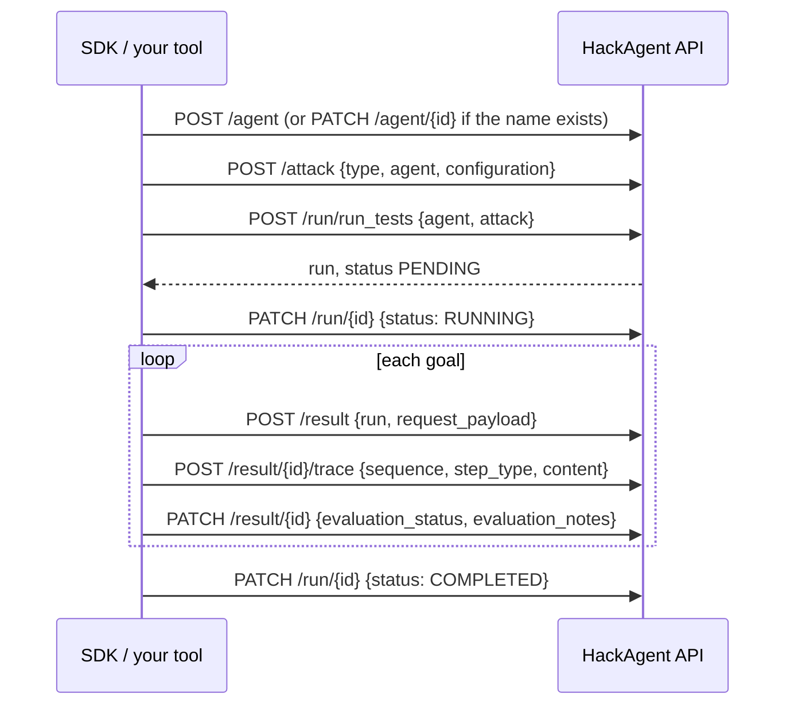

# HTTP API

The HTTP API stores what HackAgent does: the agents you test, the attacks you configure, and every run with its results and traces. The dashboard reads it, and the SDK and CLI write to it in [remote mode](../getting-started/installation.mdx#local-or-remote). It also offers an OpenAI-compatible [LLM gateway](#llm-gateway) that HackAgent uses for attacker and judge models.

Everything is JSON over HTTPS at `https://api.hackagent.dev`. The live OpenAPI schema is at [`/schema/?format=json`](https://api.hackagent.dev/schema/?format=json), browsable as [Swagger UI](https://api.hackagent.dev/schema/swagger/) or [ReDoc](https://api.hackagent.dev/schema/redoc/).

## First request

Create an API key in the [dashboard](https://app.hackagent.dev), then list your agents:

<Tabs groupId="http-client">
<TabItem value="curl" label="curl" default>

```bash
curl -sS https://api.hackagent.dev/agent \
  -H "Authorization: Bearer $HACKAGENT_API_KEY"
```

</TabItem>
<TabItem value="python" label="Python">

```python
import os
import httpx

response = httpx.get(
    "https://api.hackagent.dev/agent",
    headers={"Authorization": f"Bearer {os.environ['HACKAGENT_API_KEY']}"},
)
response.raise_for_status()
for agent in response.json()["results"]:
    print(agent["name"], agent["agent_type"])
```

</TabItem>
<TabItem value="javascript" label="JavaScript">

```javascript
const response = await fetch("https://api.hackagent.dev/agent", {
  headers: { Authorization: `Bearer ${process.env.HACKAGENT_API_KEY}` },
});
const { results } = await response.json();
```

</TabItem>
</Tabs>

<details>
<summary>Example response</summary>

```json
{
  "count": 1,
  "next": null,
  "previous": null,
  "results": [
    {
      "id": "0b5f3c2e-6a1d-4f7e-9c8b-2d4e6f8a0b1c",
      "name": "support-bot",
      "endpoint": "http://localhost:8000/v1",
      "agent_type": "OPENAI",
      "description": "",
      "metadata": {},
      "organization": "7c9e2a41-3b5d-4e6f-8a7b-9c0d1e2f3a4b",
      "organization_detail": {"id": "7c9e2a41-3b5d-4e6f-8a7b-9c0d1e2f3a4b", "name": "Acme"},
      "created_at": "2026-09-29T10:12:03.418Z",
      "updated_at": "2026-09-29T10:12:03.418Z"
    }
  ]
}
```

</details>

## Authentication

Send the API key as a bearer token on every request: `Authorization: Bearer <api-key>`. The dashboard shows a new key once, when you create it; store it like a password. The SDK and CLI read it from `HACKAGENT_API_KEY` or from `hackagent config set --api-key`.

A missing, malformed or revoked key gets `401` with `WWW-Authenticate: Bearer`. A few account endpoints only work from a signed-in dashboard session; they answer an API key with `401` and `"API key authentication not allowed on this endpoint"`. The resource sections below mark them **dashboard only**.

## Conventions

Paths have **no trailing slash**: `/agent`, not `/agent/`. Request bodies are JSON, and other content types get `415`. Records are identified by UUID, except API keys (by their prefix) and traces and usage-log entries (by integer). You only ever see your own organization's records.

List endpoints are paginated with `?page=N`, 10 items per page, and return `{"count", "next", "previous", "results"}`; `next` and `previous` are full URLs or `null`. Runs and results also take `page_size`, up to 100 and 1000.

Each user can make **1,000 requests per hour**, shared by all of their keys. Past that, requests get `429` with a `Retry-After` header. A long SDK run makes a request for every result and every trace, so large campaigns can reach the limit; the SDK can also [run locally](../getting-started/installation.mdx#local-or-remote) instead.

## How a run is recorded

This is what HackAgent sends for each attack it runs in remote mode: from `hack()` when an API key is set, and from a campaign whose `execution.storage.backend` is `remote`. Any tool can record runs the same way.



The attack itself runs on your side; the API only stores it. `POST /run/run_tests` creates the run record, with `is_client_executed: true`, and returns it with `200`.

## Resources

### Agents

An agent is a target you test. Its `name` is unique within your organization.

| Method and path | Does |
|---|---|
| `GET /agent` | List agents |
| `POST /agent` | Create an agent (`201`) |
| `GET /agent/{id}` | Get one |
| `PUT` / `PATCH /agent/{id}` | Replace or update it |
| `DELETE /agent/{id}` | Delete it with its attacks and runs (`204`) |

<details>
<summary>Fields</summary>

| Field | Type | Notes |
|---|---|---|
| `name` | string, required | Up to 200 characters |
| `endpoint` | URL, required | Up to 500 characters |
| `agent_type` | string | How HackAgent talks to it: `OLLAMA`, `OPENAI`, `LITELLM`, `GOOGLE_ADK`, `LANGCHAIN`, `CLAUDE_CODE`, `CODEX`, `HERMES`, `WEB`. Defaults to `UNKNOWN`. Agents registered by older clients may carry `OPENAI_SDK` |
| `description` | string | |
| `metadata` | object | Free-form |
| `id`, `organization`, `organization_detail`, `created_at`, `updated_at` | read-only | Set by the server |

</details>

### Attacks

An attack is a configured technique against one agent: `type` is the attack name (such as `pair`) and `configuration` its `attack_config`.

| Method and path | Does |
|---|---|
| `GET /attack` | List attacks |
| `POST /attack` | Create one: `type`, `agent` (UUID) and `configuration` are required (`201`) |
| `GET` / `PUT` / `PATCH` / `DELETE /attack/{id}` | Get, replace, update or delete one |

Responses add `agent_name`, `owner_username` and `organization_name`.

### Runs {#runs}

A run is one execution of an attack.

| Method and path | Does |
|---|---|
| `GET /run` | List runs. Filter with `agent`, `attack`, `status` or `is_client_executed` |
| `POST /run/run_tests` | Create a run for an `agent` and `attack` in your organization. Optional `run_config` is merged over the attack's configuration, and `run_notes` is free text. Returns the `PENDING` run with `200` |
| `GET /run/{id}` | Get one run with all of its results and their traces |
| `PATCH /run/{id}` | Update `status`, `run_notes` or `run_config` |
| `DELETE /run/{id}` | Delete it with its results and traces (`204`) |

List items are summaries: instead of the results they carry `attack_type`, `total_results`, `successful_jailbreaks`, `failed_jailbreaks`, `errors` and `not_evaluated` counts. `status` is one of `PENDING`, `RUNNING`, `COMPLETED`, `FAILED` or `CANCELLED`.

<details>
<summary>Example: list the completed runs of one agent</summary>

```bash
curl -sS "https://api.hackagent.dev/run?agent=$AGENT_ID&status=COMPLETED&page_size=50" \
  -H "Authorization: Bearer $HACKAGENT_API_KEY"
```

</details>

### Results and traces {#results}

A result is one attempt against the target: what was sent, what came back, and the verdict. Traces record the steps of that attempt in order.

| Method and path | Does |
|---|---|
| `GET /result` | List results. Filter with `run` or `evaluation_status` |
| `POST /result` | Create a result; `run` (UUID) is required (`201`) |
| `GET` / `PUT` / `PATCH` / `DELETE /result/{id}` | Get, replace, update or delete one. Responses include its `traces` |
| `POST /result/{id}/trace` | Append a trace step (`201`) |

<details>
<summary>Result and trace fields</summary>

| Result field | Type | Notes |
|---|---|---|
| `run` | UUID, required | |
| `request_payload` | object | What was sent to the target |
| `response_status_code`, `response_headers`, `response_body` | | The target's reply |
| `latency_ms` | integer | |
| `detected_tool_calls` | object | |
| `evaluation_status` | string | See below |
| `evaluation_notes` | string | The judges' explanation |
| `evaluation_metrics` | object | Scores |
| `agent_specific_data` | object | Technique-specific fields |

`evaluation_status` is `NOT_EVALUATED`, `SUCCESSFUL_JAILBREAK`, `FAILED_JAILBREAK`, `ERROR_AGENT_RESPONSE`, `ERROR_TEST_FRAMEWORK`, `PASSED_CRITERIA` or `FAILED_CRITERIA`.

| Trace field | Type | Notes |
|---|---|---|
| `sequence` | integer, required | Order within the result; unique per result |
| `step_type` | string | `TOOL_CALL`, `TOOL_RESPONSE`, `AGENT_THOUGHT`, `AGENT_RESPONSE_CHUNK`, `MCP_STEP`, `A2A_COMM` or `OTHER` (the default) |
| `content` | object | The step itself |

</details>

<details>
<summary>Example: count one run's successful attacks</summary>

```bash
curl -sS "https://api.hackagent.dev/result?run=$RUN_ID&evaluation_status=SUCCESSFUL_JAILBREAK" \
  -H "Authorization: Bearer $HACKAGENT_API_KEY" | jq .count
```

</details>

### Your account

| Method and path | Does |
|---|---|
| `GET /key/context` | The user and organization the key belongs to: `user_id`, `username`, `organization_id`, `organization_name` |
| `GET /organization/me` | Your organization, including its `credits` balance |
| `GET` / `PUT /user/me` | Your profile: `email`, `first_name`, `last_name` |
| `GET` / `POST /key`, `GET` / `DELETE /key/{prefix}` | Manage API keys. **Dashboard only**: a key cannot create or delete keys |
| `GET /apilogs`, `GET /apilogs/summary` | Gateway usage: tokens and credits per call, or per day between `start_date` and `end_date` (at most 92 days). **Dashboard only** |

## LLM gateway

`POST /v1/chat/completions` is an OpenAI-compatible chat endpoint. HackAgent's default attacker, judge and category classifier use it in remote mode, and you can call it from any OpenAI client by setting the base URL to `https://api.hackagent.dev/v1`.

<Tabs groupId="http-client">
<TabItem value="curl" label="curl" default>

```bash
curl -sS https://api.hackagent.dev/v1/chat/completions \
  -H "Authorization: Bearer $HACKAGENT_API_KEY" \
  -H "Content-Type: application/json" \
  -d '{"messages": [{"role": "user", "content": "Say hello"}], "max_tokens": 50}'
```

</TabItem>
<TabItem value="python" label="Python (OpenAI SDK)">

```python
import os
from openai import OpenAI

client = OpenAI(
    base_url="https://api.hackagent.dev/v1",
    api_key=os.environ["HACKAGENT_API_KEY"],
)
reply = client.chat.completions.create(
    model="default",  # ignored: the server chooses the model
    messages=[{"role": "user", "content": "Say hello"}],
    max_tokens=50,
)
print(reply.choices[0].message.content)
```

</TabItem>
</Tabs>

The server chooses the model and ignores `model` in the request. Streaming is not supported (`"stream": true` gets `501`), and `max_tokens` is capped at 4,096. The response is a standard chat completion with `usage` token counts.

<Modal trigger="How gateway calls use credits" title="Credits">

Gateway calls are paid from your organization's credit balance, which `GET /organization/me` returns as `credits`. Before a call, the gateway checks that the balance covers the largest cost the request could have; if not, it returns `402` with `"code": "INSUFFICIENT_CREDITS"`. After the call it deducts the actual cost, based on the tokens used. Every call, including a failed one, appears in the dashboard's usage log.

Nothing else in the API uses credits: recording agents, runs and results is free, and so is running HackAgent with your own attacker and judge models.

</Modal>

## Errors {#errors}

Errors use the status code, with a JSON body in one of three shapes:

<Tabs groupId="error-shape">
<TabItem value="detail" label="Most endpoints" default>

```json
{"detail": "Authentication credentials were not provided."}
```

Validation errors (`400`) name each field instead: `{"endpoint": ["Enter a valid URL."]}`.

</TabItem>
<TabItem value="gateway" label="LLM gateway">

```json
{
  "error": "Insufficient credits for this operation.",
  "code": "INSUFFICIENT_CREDITS",
  "details": "Estimated cost: 0.081920 USD, Available: 0.050000 USD. Please add credits to continue."
}
```

</TabItem>
<TabItem value="run-tests" label="POST /run/run_tests">

```json
{"error": "Agent not found in user's organization or access denied."}
```

</TabItem>
</Tabs>

| Status | Means |
|---|---|
| `400` | The body failed validation, or a gateway request had invalid JSON or `max_tokens` |
| `401` | Missing or invalid key, or an API key on a dashboard-only endpoint |
| `402` | Not enough credits for a gateway call (`INSUFFICIENT_CREDITS`) |
| `403` | `POST /run/run_tests` with an agent or attack outside your organization, or a gateway call from an account without one |
| `404` | No such record in your organization, or a page past the end |
| `415` | The body is not JSON |
| `429` | Rate limited; wait for `Retry-After`. The gateway also returns it, as `PROVIDER_RATE_LIMITED`, when the model provider is busy |
| `501` | Streaming requested from the gateway |
| `502`, `504` | The gateway could not reach the model provider, or it timed out |

The Python SDK raises `ApiError` for a failed API call; with `raise_on_unexpected_status=True` it raises `UnexpectedStatus`, carrying the status code and raw body, for undocumented statuses.
