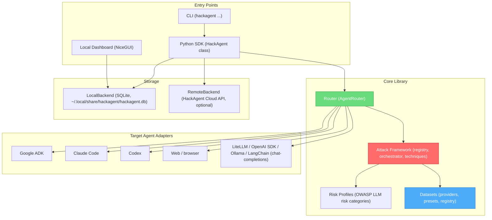
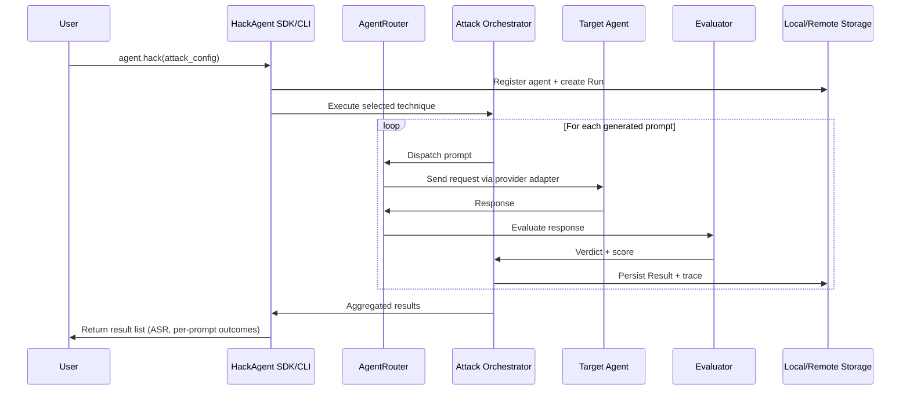

# System Architecture Overview

HackAgent is a **local-first Python SDK and CLI** for red-teaming AI agents. There is no server to deploy and no database to provision to get started — the `hackagent` package runs entirely on your machine, storing results in a local SQLite database, and can optionally sync to HackAgent Cloud when an API key is configured.

## High-Level Architecture

### Explore Components

import Link from '@docusaurus/Link';

  

    <Link to="/attacks/" style={{textDecoration: 'none', display: 'block', padding: '1rem', borderRadius: '8px', background: 'var(--ifm-background-surface-color)', border: '2px solid var(--ifm-color-primary)'}}>
      <h4 style={{margin: 0}}>Attack Engine</h4>
      
Learn about different attack types and techniques

    </Link>
  

  

    <Link to="/datasets/" style={{textDecoration: 'none', display: 'block', padding: '1rem', borderRadius: '8px', background: 'var(--ifm-background-surface-color)', border: '2px solid var(--ifm-color-primary)'}}>
      <h4 style={{margin: 0}}>Datasets</h4>
      
Configure data sources for security testing

    </Link>
  

  

    <Link to="/agents/google-adk" style={{textDecoration: 'none', display: 'block', padding: '1rem', borderRadius: '8px', background: 'var(--ifm-background-surface-color)', border: '2px solid var(--ifm-color-primary)'}}>
      <h4 style={{margin: 0}}>Google ADK</h4>
      
Test Google ADK-based agents

    </Link>
  

  

    <Link to="/agents/openai-sdk" style={{textDecoration: 'none', display: 'block', padding: '1rem', borderRadius: '8px', background: 'var(--ifm-background-surface-color)', border: '2px solid var(--ifm-color-primary)'}}>
      <h4 style={{margin: 0}}>OpenAI SDK</h4>
      
Test OpenAI SDK-based agents

    </Link>
  

## Core Components

### Entry Points

**Python SDK (`hackagent.agent.HackAgent`)**
- The main client class. Construct it with the target agent's `endpoint`/`agent_type`, then call `.hack(attack_config=...)` to run an attack and get results back.
- Chooses a `LocalBackend` or `RemoteBackend` automatically based on whether an API key is resolved (`HACKAGENT_API_KEY` env var or explicit `api_key=`).

**CLI (`hackagent/cli/`)**
- A Click-based CLI (`hackagent init`, `agent`, `eval`, `scan`, `claude`, `codex`, `web`, `datasets`, `results`, `config`, `examples`) that wraps the SDK for interactive and scripted use. See [CLI Reference](../cli/overview.md).

**Local Dashboard (`hackagent/server/dashboard/`)**
- A [NiceGUI](https://nicegui.io/) app (`hackagent web`) that reads directly from the local SQLite database to visualize runs, results, and attack traces — no separate backend process required.

### Router

**`hackagent.router.AgentRouter`**
- Resolves an `AgentTypeEnum` (e.g. `GOOGLE_ADK`, `CLAUDE_CODE`, `CODEX`, `WEB`, `LITELLM`, `OPENAI_SDK`, `OLLAMA`, `LANGCHAIN`) to a provider adapter and dispatches attack prompts to the target agent.
- `GOOGLE_ADK`, `CLAUDE_CODE`, `CODEX`, and `WEB` use dedicated adapter classes in `hackagent/router/providers/`. The remaining chat-completions-style types are driven generically through `provider_config.py` + `_ChatRegistration`.
- Tracks per-step traces via `hackagent/router/tracking/` for later inspection in the dashboard.

### Attack Framework (`hackagent/attacks/`)

- **Registry & orchestrator**: `registry.py` maps attack-technique names to implementations; `orchestrator.py` runs a technique end-to-end against a configured agent.
- **Techniques** (`attacks/techniques/`): Baseline, StaticTemplate, FlipAttack, BON, CipherChat, H4rm3l, MML, FC/tFC, PAP, PAIR, TAP, AdvPrefix, AutoDAN-Turbo, RAG (indirect prompt injection). See [Attacks](../attacks/index.mdx) for the full catalog.
- **Evaluator** (`attacks/evaluator/`): shared judge/pattern-based evaluators and metrics used across techniques to score attack success.

### Risk Profiles (`hackagent/risks/`)

- One package per OWASP-style LLM risk category (jailbreak, prompt injection, sensitive information disclosure, excessive agency, model evasion, etc.), each defining vulnerability types and a `profile.py` that maps the category to relevant attack techniques. See [AI Risks](../risks/index.mdx).

### Datasets (`hackagent/datasets/`)

- Pluggable dataset providers (`file`, `huggingface`, `url_json`), curated presets, and an intent-category taxonomy, all resolved through a central `registry.py`. See [Datasets](../datasets/index.md).

### Storage

**`LocalBackend` (default)**
- SQLite database at `~/.local/share/hackagent/hackagent.db`. No network access or account required — this is what most SDK/CLI usage runs against.

**`RemoteBackend` (optional)**
- Used automatically once a HackAgent Cloud API key is resolved. Talks to `https://api.hackagent.dev` through the generated OpenAPI client in `hackagent/server/`, enabling team dashboards and hosted result storage.

Both backends implement the same `StorageBackend` protocol (`hackagent/server/storage/base.py`), so the router, attack orchestrator, tracker, and TUI/dashboard code are fully decoupled from where results are actually persisted.

## Attack Execution Flow

## Testing

- **Unit and integration tests** live under `tests/`, run with `pytest` via `uv run pytest` (see `pyproject.toml` / `pytest.ini`).
- CI (`.github/workflows/`) runs linting (`ruff`), type checks, and the test suite on every pull request; `codecov.yml` tracks patch coverage.

This local-first design keeps the feedback loop tight: install the package, point it at a target agent, and run an attack — with an optional path to HackAgent Cloud for teams that want shared dashboards and history.
