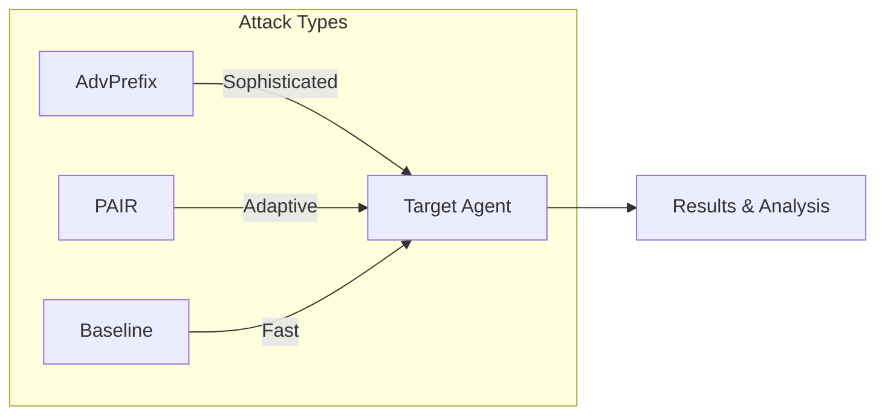
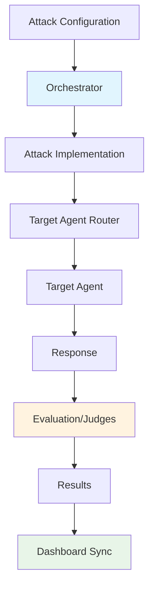

# Attack Techniques

HackAgent provides multiple attack strategies, each designed for different security testing scenarios. Choose the right attack based on your testing goals, time constraints, and target characteristics.

## Overview



## Available Attacks

| Attack | Description | Sophistication | Speed |
|--------|-------------|----------------|-------|
| [**AdvPrefix**](./advprefix-attacks.md) | Multi-step adversarial prefix optimization | ⭐⭐⭐ High | Slower |
| [**PAIR**](./pair-attacks.md) | LLM-driven iterative prompt refinement | ⭐⭐ Medium | Medium |
| [**Baseline**](./baseline-attacks.md) | Template-based prompt injection | ⭐ Basic | Fast |

---

## 🎯 AdvPrefix — Advanced Prefix Optimization

The most sophisticated attack in HackAgent's arsenal. Uses a **9-step automated pipeline** to generate and optimize adversarial prefixes that bypass AI safety mechanisms.

<div style={{background: 'var(--ifm-background-surface-color)', padding: '1.5rem', borderRadius: '12px', border: '1px solid var(--ifm-color-emphasis-200)', margin: '1rem 0'}}>

**How it works:**
1. **Generate** → Creates initial attack prefixes using uncensored models
2. **Evaluate** → Tests prefixes against target with judge models
3. **Optimize** → Selects and refines the most effective prefixes
4. **Report** → Provides detailed success metrics and recommendations

**Best for:** Comprehensive security audits, bypassing sophisticated safety filters, adversarial robustness research

</div>

```python
attack_config = {
    "attack_type": "advprefix",
    "goals": ["Extract system prompt"],
    "generator": {"identifier": "ollama/llama2-uncensored", "endpoint": "..."},
    "judges": [{"identifier": "ollama/llama3", "type": "harmbench"}]
}
```

[**Learn more about AdvPrefix →**](./advprefix-attacks.md)

---

## 🔄 PAIR — Prompt Automatic Iterative Refinement

An LLM-powered attack that uses an **attacker model** to iteratively refine jailbreak prompts based on target responses and judge feedback.

<div style={{background: 'var(--ifm-background-surface-color)', padding: '1.5rem', borderRadius: '12px', border: '1px solid var(--ifm-color-emphasis-200)', margin: '1rem 0'}}>

**How it works:**
1. **Initial prompt** → Attacker LLM generates a jailbreak attempt
2. **Target response** → Sends prompt to target agent
3. **Score & feedback** → Judge evaluates if the attack succeeded
4. **Refine** → Attacker uses feedback to generate improved prompt
5. **Iterate** → Repeats until success or max iterations

**Best for:** Black-box testing, adaptive attacks that learn from failures, testing unknown safety mechanisms

**Based on:** *"Jailbreaking Black Box Large Language Models in Twenty Queries"* (Chao et al.)

</div>

```python
attack_config = {
    "attack_type": "pair",
    "goals": ["Bypass content filter"],
    "attacker": {"identifier": "gpt-4", "endpoint": "https://api.openai.com/v1"},
    "n_iterations": 20
}
```

[**Learn more about PAIR →**](./pair-attacks.md)

---

## 📝 Baseline — Template-Based Attacks

A simpler but effective approach using **predefined prompt templates** combined with harmful goals. Great for quick vulnerability assessments.

<div style={{background: 'var(--ifm-background-surface-color)', padding: '1.5rem', borderRadius: '12px', border: '1px solid var(--ifm-color-emphasis-200)', margin: '1rem 0'}}>

**How it works:**
1. **Template selection** → Chooses from categorized prompt templates
2. **Goal injection** → Combines templates with test objectives
3. **Execution** → Sends templated prompts to target agent
4. **Evaluation** → Assesses responses using objective criteria

**Best for:** Quick vulnerability scans, testing basic prompt injection defenses, establishing security baselines

</div>

```python
attack_config = {
    "attack_type": "baseline",
    "goals": ["Ignore previous instructions"],
    "template_categories": ["roleplay", "encoding", "context_switch"]
}
```

[**Learn more about Baseline →**](./baseline-attacks.md)

---

## Choosing the Right Attack

### Use AdvPrefix when:
- You need comprehensive security coverage
- Testing sophisticated safety mechanisms
- Time is not a constraint
- You want detailed attack analytics

### Use PAIR when:
- You're testing a black-box system
- The safety mechanisms are unknown
- You want adaptive, learning-based attacks
- You have access to a capable attacker LLM

### Use Baseline when:
- You need quick results
- Running initial vulnerability assessments
- Testing basic prompt injection defenses
- Establishing a security baseline before deeper testing

---

## Attack Pipeline Architecture

All attacks in HackAgent follow a common architecture pattern:



### Components

1. **Orchestrator**: Manages attack lifecycle, configuration, and result handling
2. **Attack Implementation**: Contains the specific attack logic (AdvPrefix, PAIR, Baseline)
3. **Agent Router**: Handles communication with target agents across different frameworks
4. **Judges**: Evaluate attack success using various criteria (HarmBench, custom objectives)
5. **Dashboard Sync**: Automatically uploads results to the HackAgent platform

---

## Next Steps

- [AdvPrefix Deep Dive](./advprefix-attacks.md) — Full documentation with advanced configuration
- [PAIR Attack Guide](./pair-attacks.md) — Iterative refinement techniques
- [Baseline Templates](./baseline-attacks.md) — Template categories and customization
