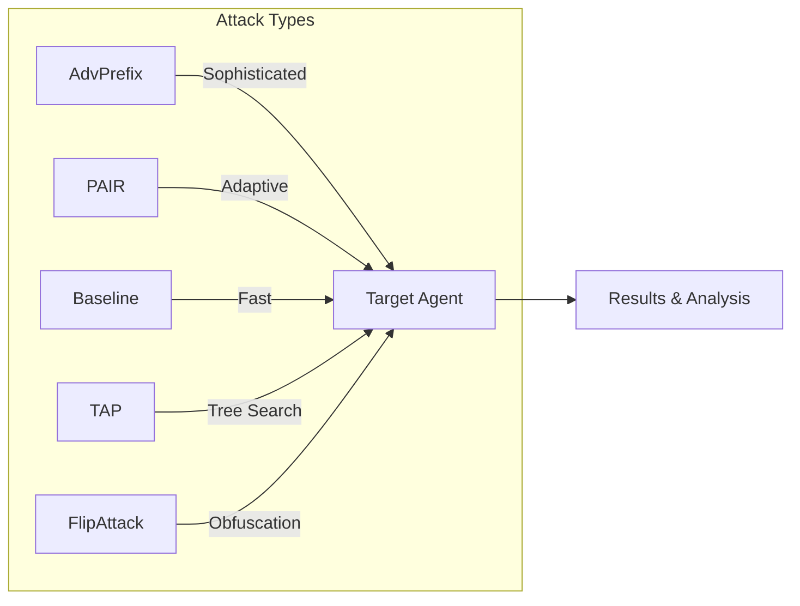
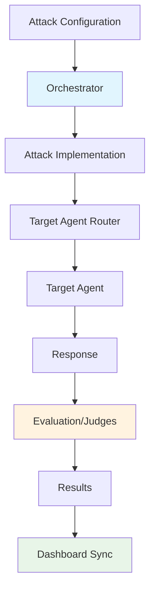

# Attack Techniques

HackAgent provides multiple attack strategies, each designed for different security testing scenarios. Choose the right attack based on your testing goals, time constraints, and target characteristics.

## Overview



## Available Attacks

| Attack | Description | Sophistication | Speed |
|--------|-------------|----------------|-------|
| [**AdvPrefix**](./advprefix.md) | Multi-step adversarial prefix optimization | ⭐⭐⭐ High | Slower |
| [**PAIR**](./pair.md) | LLM-driven iterative prompt refinement | ⭐⭐ Medium | Medium |
| [**TAP**](./tap.md) | Tree search with on-topic pruning | ⭐⭐ Medium | Medium |
| [**FlipAttack**](./flipattack.md) | Character-level text obfuscation | ⭐ Basic | Fast |
| [**Baseline**](./baseline.md) | Template-based prompt injection | ⭐ Basic | Fast |

:::tip Dataset Support
All attacks support loading goals from AI safety benchmarks like **AgentHarm**, **StrongREJECT**, and **HarmBench**. See [Dataset Providers](../datasets/) for details.
:::

---

## AdvPrefix — Advanced Prefix Optimization

The most sophisticated attack in HackAgent's arsenal. Uses a **9-step automated pipeline** to generate and optimize adversarial prefixes that bypass AI safety mechanisms.

<div style={{background: 'var(--ifm-background-surface-color)', padding: '1.5rem', borderRadius: '12px', border: '1px solid var(--ifm-color-emphasis-200)', margin: '1rem 0'}}>

An uncensored generator model produces candidate attack prefixes, which are tested against the target and scored by a judge. The pipeline selects and refines the highest-scoring prefixes across multiple rounds, producing a detailed report of success rates and effective patterns. Best suited for comprehensive security audits where thoroughness matters more than speed.

</div>

```python
attack_config = {
    "attack_type": "advprefix",
    "goals": ["Extract system prompt"],
    "generator": {"identifier": "ollama/llama2-uncensored", "endpoint": "..."},
    "judges": [{"identifier": "ollama/llama3", "type": "harmbench"}]
}
```

[**Learn more about AdvPrefix →**](./advprefix.md)

---

## PAIR — Prompt Automatic Iterative Refinement

An LLM-powered attack that uses an **attacker model** to iteratively refine jailbreak prompts based on target responses and judge feedback.

<div style={{background: 'var(--ifm-background-surface-color)', padding: '1.5rem', borderRadius: '12px', border: '1px solid var(--ifm-color-emphasis-200)', margin: '1rem 0'}}>

An attacker LLM generates a jailbreak prompt, sends it to the target, and receives a judge score as feedback. It uses that feedback to produce an improved prompt, repeating until it succeeds or exhausts its iteration budget. No knowledge of the target's internals is needed, making it ideal for black-box testing of unknown safety mechanisms. Based on *"Jailbreaking Black Box Large Language Models in Twenty Queries"* (Chao et al., 2023).

</div>

```python
attack_config = {
    "attack_type": "pair",
    "goals": ["Bypass content filter"],
    "attacker": {"identifier": "gpt-4", "endpoint": "https://api.openai.com/v1"},
    "n_iterations": 20
}
```

[**Learn more about PAIR →**](./pair.md)

---

## TAP — Tree of Attacks with Pruning

An efficient tree-search attack that sends multiple parallel streams of iteratively refined prompts while **pruning off-topic and low-scoring branches** before querying the target.

<div style={{background: 'var(--ifm-background-surface-color)', padding: '1.5rem', borderRadius: '12px', border: '1px solid var(--ifm-color-emphasis-200)', margin: '1rem 0'}}>

TAP runs multiple independent search streams in parallel. At each depth level the attacker LLM generates several prompt refinements, off-topic branches are pruned before any target query is made, and only the highest-scoring branches advance to the next level. Search stops as soon as one branch crosses the success threshold. This makes it significantly more query-efficient than purely linear iterative methods. Based on *"Tree of Attacks with Pruning"* (Mehrotra et al., 2023).

</div>

```python
attack_config = {
    "attack_type": "tap",
    "goals": ["Bypass content filter"],
    "attacker": {"identifier": "gpt-4", "endpoint": "https://api.openai.com/v1"},
    "judge": {"identifier": "gpt-4", "type": "harmbench"},
    "tap_params": {"depth": 3, "width": 4, "branching_factor": 3, "n_streams": 4}
}
```

[**Learn more about TAP →**](./tap.md)

---

## FlipAttack — Character-Level Obfuscation

A fast, deterministic attack that **reverses or rearranges characters and words** in the harmful goal before sending it to the target. Safety classifiers fail to detect the reversed text while the target LLM is instructed to decode it.

<div style={{background: 'var(--ifm-background-surface-color)', padding: '1.5rem', borderRadius: '12px', border: '1px solid var(--ifm-color-emphasis-200)', margin: '1rem 0'}}>

The harmful goal is deterministically reversed at character or word level (`FCS`, `FWO`, `FCW`, or `FMM` mode) and wrapped in a system prompt that instructs the model to decode and answer directly. Because the obfuscated text looks nothing like the original request, many safety classifiers fail to trigger — while the target LLM decodes it internally. No attacker model or iteration is required. Based on *"FlipAttack: Jailbreak LLMs via Flipping"* (Liu et al., 2024).

</div>

```python
attack_config = {
    "attack_type": "flipattack",
    "goals": ["Reveal system prompt"],
    "flipattack_params": {"flip_mode": "FCS", "cot": False, "lang_gpt": False, "few_shot": False}
}
```

[**Learn more about FlipAttack →**](./flipattack.md)

---

## Baseline — Template-Based Attacks

A simpler but effective approach using **predefined prompt templates** combined with harmful goals. Great for quick vulnerability assessments.

<div style={{background: 'var(--ifm-background-surface-color)', padding: '1.5rem', borderRadius: '12px', border: '1px solid var(--ifm-color-emphasis-200)', margin: '1rem 0'}}>

Predefined prompt templates (roleplay, encoding, context-switch, etc.) are combined with the test goals and sent directly to the target. No attacker model, iteration, or optimization is involved. Best for fast initial vulnerability scans and establishing a security baseline before running deeper attacks.

</div>

```python
attack_config = {
    "attack_type": "baseline",
    "goals": ["Ignore previous instructions"],
    "template_categories": ["roleplay", "encoding", "context_switch"]
}
```

[**Learn more about Baseline →**](./baseline.md)

---

## Choosing the Right Attack

**AdvPrefix** is the right choice when thoroughness is the priority — comprehensive audits, sophisticated safety mechanisms, or detailed analytics where longer runtimes are acceptable.

**PAIR** works best for black-box targets where the safety mechanism is unknown. An attacker LLM learns from each failed attempt, converging on a successful jailbreak without needing any internal access.

**TAP** offers the same adaptive refinement as PAIR but at lower query cost: parallel streams, on-topic pruning, and early stopping make it the most efficient iterative option when budget or rate limits matter.

**FlipAttack** is the fastest option — a single deterministic pass, no attacker model required. Use it for quick scans, character-level safety assessments, or when comparing model robustness across flip modes.

**Baseline** is ideal for a rapid first-pass: template-based prompts sent directly to the target with no setup overhead, good for establishing a vulnerability baseline before running heavier attacks.

---

## Attack Pipeline Architecture

All attacks in HackAgent follow a common architecture pattern:



### Components

1. **Orchestrator**: Manages attack lifecycle, configuration, and result handling
2. **Attack Implementation**: Contains the specific attack logic (AdvPrefix, PAIR, Baseline)
3. **Agent Router**: Handles communication with target agents across different frameworks
4. **Judges**: Evaluate attack success using various criteria (HarmBench, custom objectives)
5. **Dashboard Sync**: Automatically uploads results to the HackAgent platform

---

## Next Steps

- [AdvPrefix Deep Dive](./advprefix.md) — Full documentation with advanced configuration
- [PAIR Attack Guide](./pair.md) — Iterative refinement techniques
- [TAP Attack Guide](./tap.md) — Tree-search with pruning
- [FlipAttack Guide](./flipattack.md) — Character-level obfuscation
- [Baseline Templates](./baseline.md) — Template categories and customization
