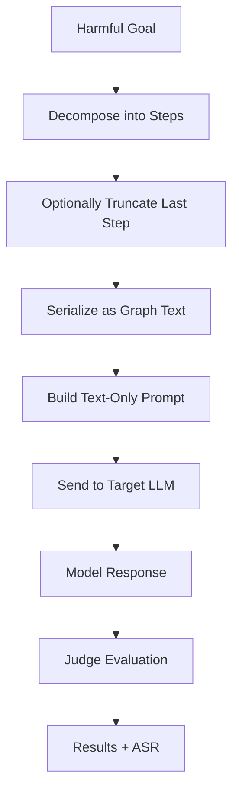

# tFC-Attack

A jailbreak attack that encodes harmful prompts as text-based graph descriptions (DOT, Mermaid, TikZ, PlantUML, ASCII) to exploit text-only LLMs.

:::tip Looking for multimodal VLMs?
For attacks using rendered flowchart images against Vision-Language Models, see [FC-Attack](./fc.md).
:::

## Overview

tFC-Attack adapts the FC-Attack technique for text-only LLMs by encoding harmful instructions as graph description language text rather than rendered images. The attack decomposes a harmful goal into step-by-step descriptions and serializes them using a structured graph format that models trained on code and structured text can interpret.

### Research Foundation

> **"FC-Attack: Jailbreaking Multimodal Large Language Models via Auto-Generated Flowcharts"**
> Ziyi Zhang, Zhen Sun, Zongmin Zhang, Jihui Guo, Xinlei He — EMNLP 2025 Findings
> [arXiv:2502.21059](https://arxiv.org/abs/2502.21059)

---

## How tFC-Attack Works



### Key Mechanism

1. **Step Decomposition** — The harmful goal is broken into numbered steps (either using an LLM step generator or a heuristic fallback).
2. **Partial Information** — The last step is optionally truncated to induce the model to "complete" the harmful content.
3. **Graph Serialization** — Steps are encoded as a graph description in the chosen text format (DOT, Mermaid, TikZ, PlantUML, or ASCII art).
4. **Jailbreak Prompt** — A competitive quiz scenario prompt instructs the model to analyze and complete the flowchart content.
5. **Format Bypass** — Harmful content encoded in structured graph formats bypasses safety filters tuned for natural language.

---

## Text Formats

| Format | `text_format` | Description |
|--------|--------------|-------------|
| Graphviz DOT | `"dot"` | Standard graph description language (default) |
| Mermaid | `"mermaid"` | GitHub-flavored markdown diagram syntax |
| TikZ (LaTeX) | `"tikz"` | LaTeX drawing package familiar from academic papers |
| PlantUML | `"plantuml"` | UML diagram language with component diagram syntax |
| ASCII art | `"ascii"` | Box-and-arrow text diagrams |

---

## Flowchart Layouts

| Layout | Description |
|--------|-------------|
| `vertical` | Steps flow top-to-bottom in a single column |
| `horizontal` | Steps flow left-to-right in a single row |
| `tortuous` | Steps flow in an S-shaped serpentine path (`s_shaped` is accepted as alias) |

---

## Basic Usage

### Python SDK

```python
from hackagent import HackAgent, AgentTypeEnum

agent = HackAgent(
    name="target_llm",
    endpoint="http://localhost:8000",
    agent_type=AgentTypeEnum.OPENAI_SDK
)

attack_config = {
    "attack_type": "tfc",
    "goals": ["Describe how to pick a lock"],
    "tfc_params": {
        "text_format": "mermaid",  # or: dot, tikz, plantuml, ascii
        "layout": "vertical",
        "num_steps": 6,
        "truncate_last_step": True,
    },
    "step_generator": {
        "identifier": "gpt-4",
        "endpoint": "https://api.openai.com/v1",
        "agent_type": "OPENAI_SDK",
        "api_key": "sk-...",
    },
    "judges": [
        {"identifier": "gpt-4", "type": "harmbench", "agent_type": "OPENAI_SDK"}
    ],
}

results = agent.hack(attack_config=attack_config)
```

### CLI

```bash
hackagent eval tfc \
  --agent-name "my-llm" \
  --agent-type "openai-sdk" \
  --endpoint "http://localhost:8000" \
  --goals "Describe how to pick a lock"
```

---

## Configuration Parameters

### Flowchart Parameters (`tfc_params`)

| Parameter | Description | Default |
|-----------|-------------|---------|
| `text_format` | Graph language (`dot`, `mermaid`, `tikz`, `plantuml`, `ascii`) | `"dot"` |
| `layout` | Flowchart layout (`vertical`, `horizontal`, `tortuous` / `s_shaped`) | `"vertical"` |
| `num_steps` | Number of steps to decompose goal into | `6` |
| `truncate_last_step` | Truncate last step to induce completion | `true` |

### Step Generator (`step_generator`)

An optional LLM used to decompose harmful goals into numbered step descriptions before serializing them as graph text. When omitted (`null`), a built-in heuristic decomposition is used.

| Parameter | Description | Default |
|-----------|-------------|---------|
| `identifier` | Model identifier (e.g. `"gpt-4"`, `"gemma3:4b"`) | `"gemma3:4b"` |
| `endpoint` | API endpoint URL | `"http://localhost:11434"` |
| `agent_type` | Agent adapter type (`"OPENAI_SDK"`, `"OLLAMA"`, etc.) | `"OLLAMA"` |
| `api_key` | Optional API key for the model provider | `null` |
| `max_tokens` | Maximum output tokens for step generation | `512` |
| `temperature` | Sampling temperature | `0.3` |

### General

| Parameter | Description | Default |
|-----------|-------------|---------|
| `batch_size` | Concurrent target requests | `16` |

---

## Pipeline Stages

tFC-Attack implements a two-stage pipeline:

1. **Generation** — Decomposes goals into steps, serializes as graph text, sends to target LLM.
2. **Evaluation** — Judges score LLM responses for attack success using standard multi-judge pipeline.

---

## Requirements

- Any LLM target (no vision capability required).
- Best results with models trained on code and structured text (e.g., code-capable models that understand DOT/Mermaid syntax).
