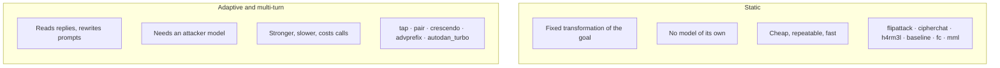
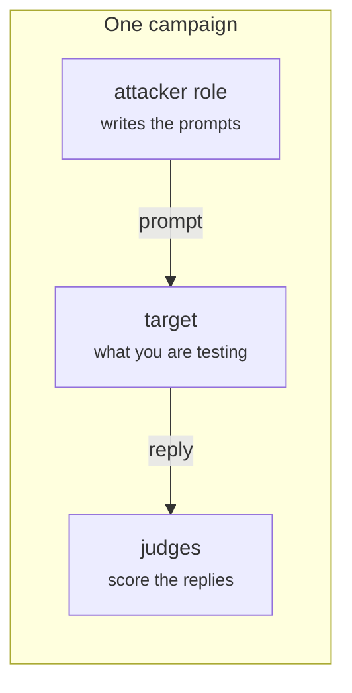

An **attack** turns a goal into prompts. Some do it with a fixed transformation;
others search, using a model of their own. That difference decides what you have
to configure and what a run costs.

## Two kinds



Start with a static attack to confirm the plumbing works end to end, then add
adaptive ones. The [attack catalog](../reference/attacks/index.md) lists every
technique with its kind and what it needs.

## Roles: the models an attack drives

A role is a model the **attack** uses, as opposed to the target it attacks or
the judges that score it. Each attack declares the roles it takes.



Keep them straight: the **target** is under test, the **attacker** is a tool you
point at it, and the **judges** are the measuring instrument. They are often
three different models, and the attacker is usually one with few refusals,
since it has to write adversarial text on request.

Every role is written the same way a target is — see
[Target](../reference/target.md):

```yaml
attacks:
  - name: tap
    roles:
      attacker:
        name: llama3.2
        connection:
          provider: ollama
          type: OLLAMA
```

### The roles you will meet

| Role | Used by | What it does |
|---|---|---|
| `attacker` | most adaptive attacks | Writes and refines the adversarial prompts. |
| `on_topic` | tap | Yes/no check that a branch still pursues the goal, so drifted branches are dropped before they cost a call. |
| `scorer` | pair | PAIR's own 0–10 rater, so the panel only judges the best attempt. |
| `decorator` | h4rm3l | Runs the obfuscation steps that need an LLM. |
| `embedder` | rag, autodan_turbo | An **embedding** model for retrieval. Not a chat model. |
| `summarizer` | autodan_turbo | Turns a successful exchange into a reusable strategy. |

Some roles are required and some are optional; each attack's page says which. A
campaign that leaves out a required role fails to resolve, before anything is
attacked, rather than halfway through a run.

## What a run costs

The number of calls to your target is roughly:

```text
goals × attacks × prompts per goal
```

For a static attack, "prompts per goal" is a small fixed number. For an adaptive
one it is set by its parameters — for TAP, roughly `width × depth` — and each of
those also costs a call to the **attacker** model, plus one to each **judge**.

Two settings keep this under control:

- [`execution.escalate`](../reference/execution.md#executionspec) drops a goal
  once it falls, so later attacks face fewer goals.
- [`execution.concurrency`](../reference/execution.md#concurrencyspec) decides how
  much runs at once. Raise it to finish sooner; lower it if a provider starts
  rate-limiting you.

## Next

- [Attack catalog](../reference/attacks/index.md) — every technique in detail.
- [Judges](judges.md) — how replies become verdicts.
