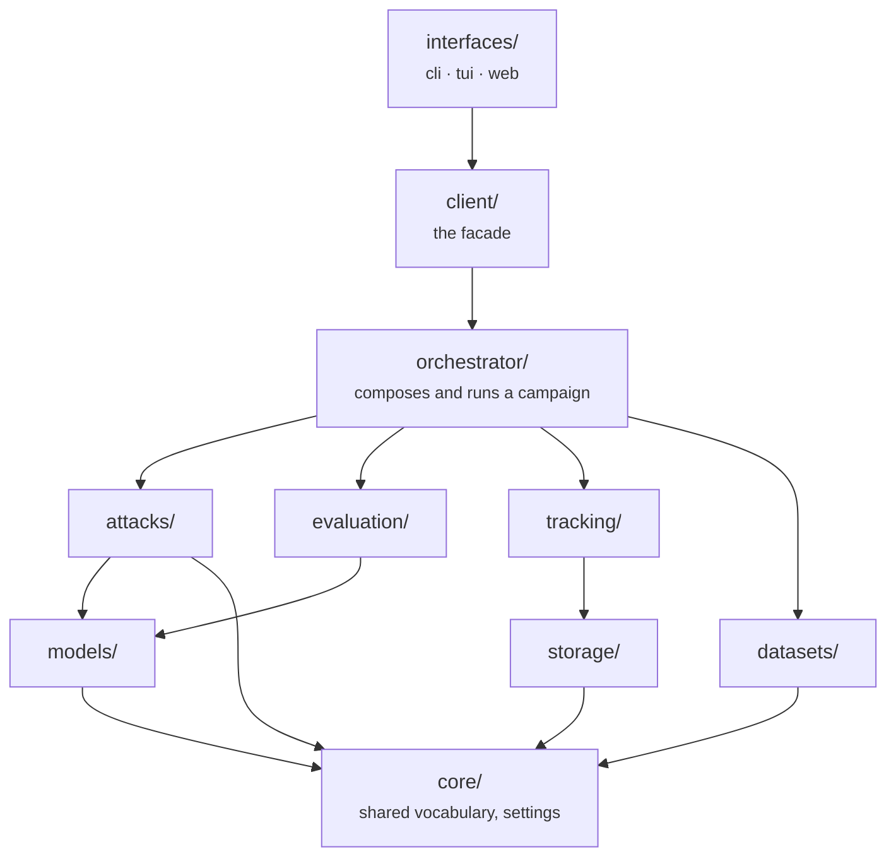
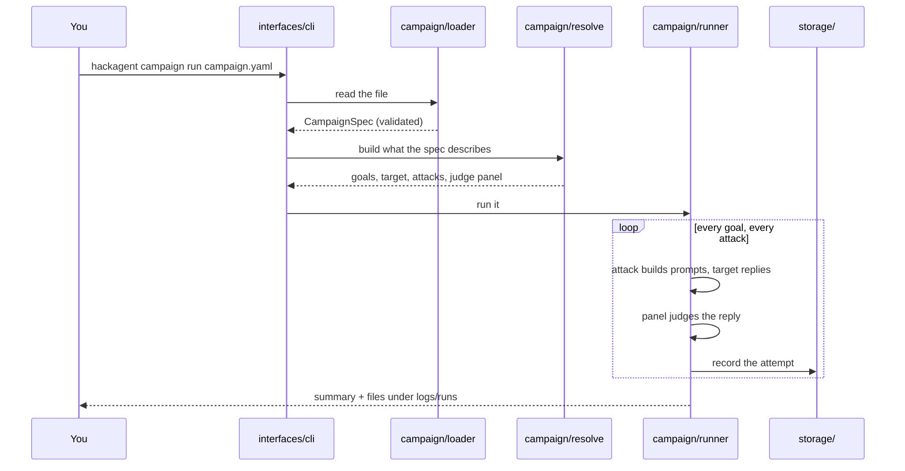

This page is for reading the source. It maps what a run *does* onto where that
happens in the repository.

## The layers

Packages are layered, and a package may only import from the layers below it.
That rule is not a convention: it is checked on every test run by
[import-linter](https://import-linter.readthedocs.io), so it cannot quietly rot.



`core/` sits at the bottom and depends on nothing: it holds the words every
other package agrees on (`Goal`, `Verdict`, `ModelSpec`, `AgentType`). Nothing
below `interfaces/` knows whether a human, a script or the terminal app started
the run.

## Following one run through the code



The split is deliberate: **loading** only checks shape, **resolving** builds live
objects (and is where a bad endpoint or missing role is caught), and **running**
does the work. `hackagent campaign validate` stops after resolving, which is why
it catches configuration mistakes without sending a request.

## Where to look for what

| If you want to change… | Look in |
|---|---|
| The campaign format itself | `hackagent/orchestrator/campaign/spec.py` |
| How a campaign becomes live objects | `hackagent/orchestrator/campaign/resolve.py` |
| The run loop, concurrency, escalation | `hackagent/orchestrator/campaign/runner.py` |
| An attack technique | `hackagent/attacks/techniques/<category>/<name>/` |
| Judge prompts and parsing | `hackagent/evaluation/judges.py` |
| How votes become a verdict | `hackagent/evaluation/` (the panel) |
| Talking to a model or agent | `hackagent/models/` |
| Loading goals, the risk taxonomy | `hackagent/datasets/` |
| Saving results | `hackagent/storage/`, `hackagent/tracking/` |
| The command line | `hackagent/interfaces/cli/` |
| The terminal app | `hackagent/interfaces/tui/` |

## Anatomy of an attack

Every technique is a folder with the same shape:

```text
attacks/techniques/adaptive/tap/
├── attack.py     the algorithm
├── config.py     its parameters and roles (TapParams)
└── prompts.py    the text it sends, kept verbatim from the paper
```

`config.py` is the interesting one for documentation: it is a Pydantic model
whose fields *are* the attack's `parameters` in a campaign file. Each field's
`description` is what the [attack's reference page](../reference/attacks/index.md)
shows, so documenting a new knob means writing it next to the knob.

A role is any field typed as a model callable rather than a value:

```python
class TapParams(AttackParams):
    REQUIRED_ROLES: ClassVar[frozenset[str]] = frozenset({"attacker"})

    width: int = Field(default=4, ge=1, description="Branches kept after each round…")
    attacker: Optional[Completion] = Field(default=None, description="Writes the prompts…")
```

The runner reads `REQUIRED_ROLES` to refuse a campaign that is missing one, and
the docs generator reads the same declaration, so the page and the behaviour
cannot disagree.

## The docs are generated from this

The [reference section](../reference/index.md) is produced by
`docs/scripts/generate_reference.py`, which reads the models above. A test fails
if the committed pages drift from the code, so:

```bash
# after changing a field, a parameter or a CLI option
uv run python docs/scripts/generate_reference.py
```

Hand-written pages — this one, the tutorial, the concept pages — cover what the
code cannot state about itself.
