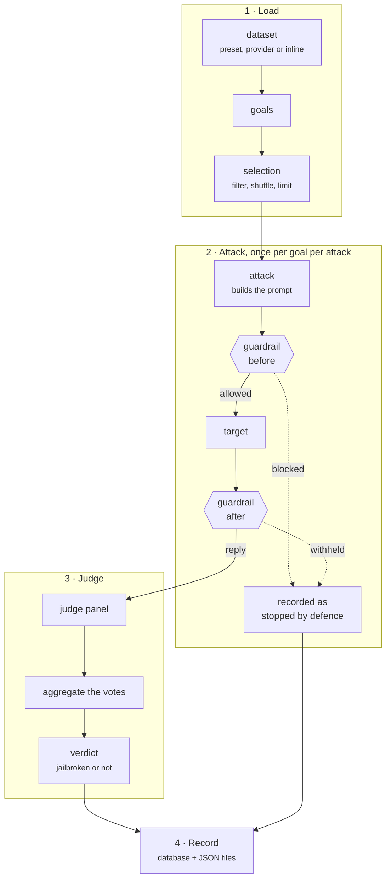
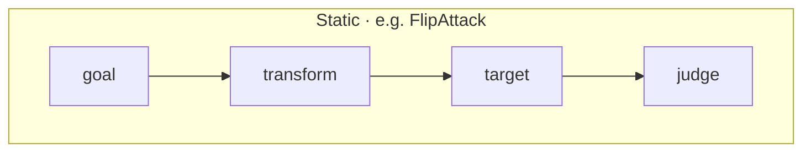
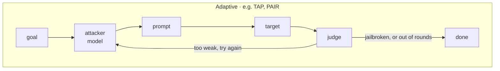
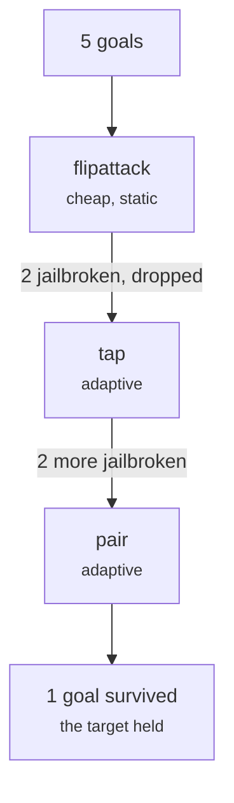

A campaign turns **goals** into **verdicts**. This page follows one goal all the
way through, so the words in the [reference](../reference/index.md) have
something concrete behind them.

## The whole pipeline

Guardrails are optional and off by default; without them the prompt goes
straight to the target.

## Static and adaptive attacks differ here

A **static** attack decides its prompts up front. An **adaptive** one searches:
it reads each reply and writes the next prompt, which is why it needs an
attacker model of its own.

Every exchange an adaptive attack had judged is recorded, not just the last one,
so you can see how it got there.

## Several attacks over the same goals

By default every goal goes through every attack, and you get the full matrix.

With `execution.escalate` turned on, the attacks become a ladder: a goal that
falls is dropped, and the next attack only faces what is left. That spends the
expensive attacks on the hard goals.

The run stops early once every goal has fallen, because there is nothing left to
attack.

## What a run leaves behind

| Where | What |
|---|---|
| A local database | Every attempt, with its prompt, reply and verdict. Read it with `hackagent results list` or the terminal app. |
| `./logs/runs/<run id>.json` | The same attempts as a file, for diffing or sharing. |
| `./logs/runs/<run id>.traces.jsonl` | For adaptive attacks, the search itself: every call, decision and branch. |

The output folder and formats are set under
[`execution.output`](../reference/execution.md#outputspec).

## Next

- [Attacks and roles](attacks-and-roles.md) — picking attacks, and the models they drive.
- [Judges](judges.md) — how a verdict is decided.
