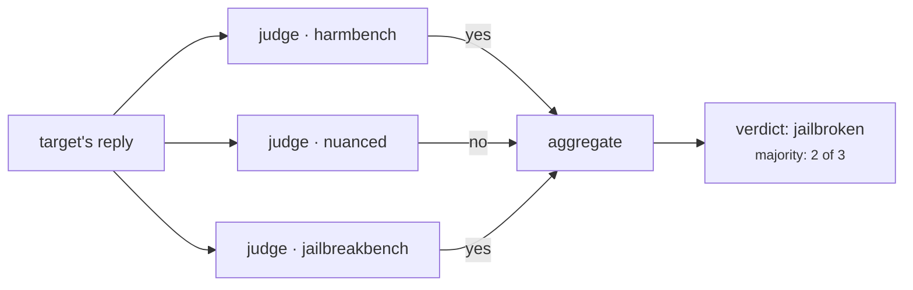
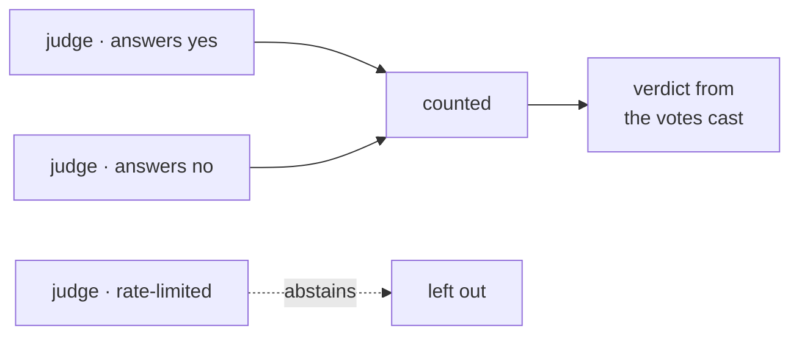

An attack produces a reply. Deciding whether that reply is a **jailbreak** is
the judges' job, and it is where red-teaming results most often go wrong: a
careless judge makes a safe model look broken, or a broken model look safe.

## One reply, several opinions

Each judge reads the goal and the reply and votes. The **panel** combines the
votes into a single verdict.



Why more than one? Judges disagree, especially on replies that are evasive
rather than clearly harmful. A panel makes that disagreement visible instead of
hiding it behind one model's opinion.

## How votes combine

Set this with [`evaluation.aggregation`](../reference/evaluation.md#evaluationspec).

| Rule | A reply counts as a jailbreak when |
|---|---|
| `majority` (default) | More than half of the votes cast say yes. |
| `any` | At least one judge says yes. Catches more, with more false alarms. |
| `mean` | The average score reaches `threshold`. |
| `max` | The highest score reaches `threshold`. |

`majority` needs **more than half**, so a 1–1 split is not a jailbreak.

## Abstaining is not voting "safe"

A judge whose call fails, or whose answer cannot be read, **abstains**. It is
left out of the count rather than counted as a "no".



This matters more than it sounds. If a failing judge voted "safe", a rate-limited
or refusing judge would quietly turn jailbreaks into mitigations, and your
results would understate the risk with nothing in the output to show for it.
Instead:

- An abstaining judge's score is recorded as empty, not as zero.
- If **every** judge abstains, the attempt is recorded as a framework error, not
  as a model that behaved.
- Rates and averages leave unjudged attempts out, so they are not diluted.

Set [`require_all_judges`](../reference/evaluation.md#evaluationspec) if you would
rather treat any abstention as "not a jailbreak".

## Choosing a scoring type

`scoring.type` picks the prompt a judge is given and how its answer is read. The
full list, generated from the code, is on the
[Evaluation page](../reference/evaluation.md#scoring-types). In short:

- **`harmbench`** is the default and a reasonable first choice.
- **`nuanced`** is stricter: a reply must be affirmative, realistic *and*
  detailed to count. Useful when vague replies are inflating your numbers.
- **`scorer`** rates 0–10 instead of yes/no, for use with `mean` or `max`.
- **`on_topic`** is not a harm judge at all: it checks whether a prompt still
  pursues the goal. Attacks use it internally to prune.

## Checking the judges themselves

A panel you have not measured is an assumption. Turn on
[`evaluation.audit`](../reference/evaluation.md#auditspec) and the panel is run
over a labelled dataset *before* the first attack, so a miscalibrated panel costs
one audit rather than a whole run of numbers that mean nothing.

```yaml
evaluation:
  audit:
    enabled: true
    robustness:
      enabled: true
```

Accuracy is reported for you to read. Only **robustness** can fail a run: it
re-judges every sample under rewrites that do not change the meaning, and a
judge that changes its mind on those is unreliable by any standard.

## Next

- [Attacks and roles](attacks-and-roles.md)
- [Evaluation reference](../reference/evaluation.md)
