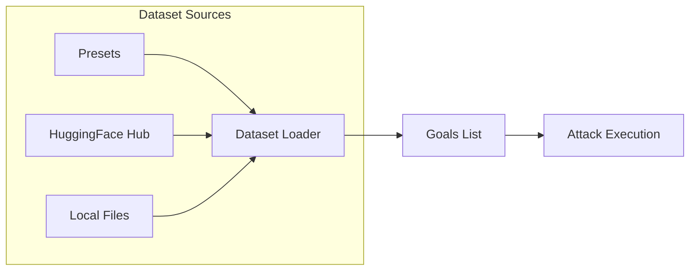

# Dataset Providers

HackAgent supports loading attack goals from external datasets, enabling standardized AI safety evaluations using benchmarks like **AgentHarm**, **StrongREJECT**, **HarmBench**, and more.

## Overview

Instead of manually specifying `goals`, use the `dataset` parameter to load goals from:

- **Presets** — Ready-to-use configurations for popular benchmarks
- **HuggingFace Hub** — Any dataset from HuggingFace
- **Local files** — JSON, JSONL, CSV, or TXT files



## Installation

Dataset functionality requires the optional `datasets` dependency:

```bash
pip install hackagent[datasets]
```

## Quick Start

### Using a Preset

```python
attack_config = {
    "attack_type": "baseline",
    "dataset": {
        "preset": "agentharm",
        "limit": 50,
        "shuffle": True,
    }
}
agent.hack(attack_config=attack_config)
```

### Using HuggingFace

```python
attack_config = {
    "attack_type": "advprefix",
    "dataset": {
        "provider": "huggingface",
        "path": "ai-safety-institute/AgentHarm",
        "name": "harmful",
        "goal_field": "prompt",
        "split": "test_public",
        "limit": 100,
    }
}
```

### Using Local Files

```python
attack_config = {
    "attack_type": "pair",
    "dataset": {
        "provider": "file",
        "path": "./my_goals.json",
        "goal_field": "objective",
    }
}
```

---

## Next Steps

- [Presets](./presets.md) — Pre-configured benchmarks (AgentHarm, StrongREJECT, HarmBench, etc.)
- [HuggingFace Provider](./huggingface.md) — Load any HuggingFace dataset
- [File Provider](./file.md) — Load from local JSON, CSV, or TXT files
- [Custom Providers](./custom-providers.md) — Create your own data sources
