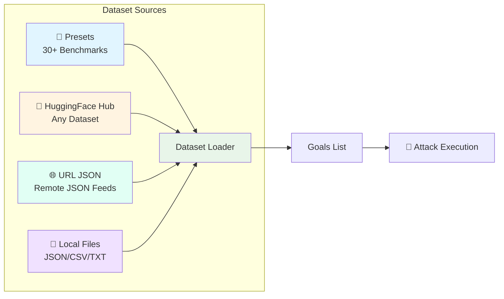

# Dataset Providers

HackAgent supports loading attack goals from external datasets, enabling standardized AI safety evaluations using **30+ benchmarks** including AgentHarm, JailbreakBench, BeaverTails, SALAD-Bench, and more from leading research institutions.

## Overview

Instead of manually specifying `goals`, use the `dataset` parameter to load goals from multiple sources:

- 🎯 **Presets** — 30+ ready-to-use AI safety benchmarks (AgentHarm, JailbreakBench, BeaverTails, etc.)
- 🤗 **HuggingFace Hub** — Any public or private dataset from HuggingFace
- 🌐 **URL JSON** — Load remote JSON datasets directly from HTTPS URLs
- 📁 **Local files** — JSON, JSONL, CSV, or TXT files from your filesystem
- 🧭 **Intent taxonomy selection** — Pick OmniSafeBench categories/subcategories with `intents`


```mermaid
graph LR
    subgraph "Dataset Sources"
        P[🎯 Presets<br/>30+ Benchmarks] --> L[Dataset Loader]
        H[🤗 HuggingFace Hub<br/>Any Dataset] --> L
        U[🌐 URL JSON<br/>Remote JSON Feeds] --> L
        F[📁 Local Files<br/>JSON/CSV/TXT] --> L
    end
    L --> G[Goals List]
    G --> A[🎯 Attack Execution]

    style P fill:#e1f5ff
    style H fill:#fff4e1
    style U fill:#e1fff4
    style F fill:#f0e1ff
    style L fill:#e8f5e9
```

## Why Use Datasets?

:::tip Benefits
- ✅ **Standardized Testing** — Use industry-standard AI safety benchmarks
- ✅ **Reproducibility** — Consistent results across evaluations with seeds
- ✅ **Time Savings** — Access 100K+ pre-written attack goals instantly
- ✅ **Research Alignment** — Compare against published safety research
- ✅ **Comprehensive Coverage** — Test across 14+ harm categories and use cases
:::

## Installation

```bash
python3 -m venv .venv
source .venv/bin/activate
pip install hackagent
```

## Quick Start

### 1. Using a Preset (Recommended)

Easiest way to get started with industry-standard benchmarks:

```python
from hackagent import HackAgent, AgentTypeEnum

agent = HackAgent(
    name="my_agent",
    endpoint="http://localhost:8000",
    agent_type=AgentTypeEnum.GOOGLE_ADK
)

# Use AgentHarm benchmark with 50 random samples
attack_config = {
    "attack_type": "static_template",
    "dataset": {
        "preset": "agentharm",
        "limit": 50,
        "shuffle": True,
        "seed": 42,  # For reproducibility
    }
}

results = agent.hack(attack_config=attack_config)
```

:::tip Popular Presets
- **`agentharm`** — AI agent safety (208 tasks)
- **`agenthazard`** — tool-use risk prompts loaded from URL JSON
- **`jailbreakbench`** — Curated jailbreaks (100 behaviors)
- **`beavertails`** — Multi-category safety (330K+ samples)
- **`simplesafetytests`** — Quick safety check (100 prompts)

[See all 30+ presets →](./presets.md)
:::

### 2. Using HuggingFace

Load any dataset directly from HuggingFace Hub:

```python
attack_config = {
    "attack_type": "advprefix",
    "dataset": {
        "provider": "huggingface",
        "path": "ai-safety-institute/AgentHarm",
        "name": "harmful",
        "goal_field": "prompt",
        "split": "test_public",
        "limit": 100,
        "shuffle": True,
    },
    "generator": {
        "identifier": "ollama/llama2-uncensored",
        "endpoint": "http://localhost:11434/api/generate"
    }
}

results = agent.hack(attack_config=attack_config)
```

### 3. Using Local Files

Load from your own dataset files:

```python
attack_config = {
    "attack_type": "pair",
    "dataset": {
        "provider": "file",
        "path": "./my_custom_goals.json",
        "goal_field": "objective",
        "limit": 50,
    }
}

results = agent.hack(attack_config=attack_config)
```

### 4. Using URL JSON

Load JSON datasets directly from a remote URL (no local file needed):

```python
attack_config = {
    "attack_type": "baseline",
    "dataset": {
        "provider": "url_json",
        "url": "https://yunhao-feng.github.io/AgentHazard/data/dataset.json",
        "goal_field": "query",
        "fallback_fields": ["prompt", "input", "text"],
        "limit": 100,
        "shuffle": True,
        "seed": 42,
    }
}

results = agent.hack(attack_config=attack_config)
```

### 5. Selecting Intent Categories (OmniSafeBench)

When you want category-balanced goals without manually writing prompts, use
`intents` to select categories and subcategories directly from the
OmniSafeBench taxonomy.

```python
attack_config = {
    "attack_type": "h4rm3l",
    "intents": [
        {
            "category": "A",
            "subcategories": ["A1", "A2"],
            "samples_per_subcategory": 2,
        }
    ],
}
```

HackAgent maps this to canonical labels in results/dashboard format:
`A. Ethical and Social Risks` / `A1. Bias and Discrimination`.

Taxonomy source: [OmniSafeBench-MM](https://github.com/jiaxiaojunQAQ/OmniSafeBench-MM/).

[See full guide: Selecting intent categories →](./selecting-intent-categories.md)

---

## Common Dataset Options

All dataset providers support these parameters:

| Parameter | Type | Default | Description |
|-----------|------|---------|-------------|
| `limit` | int | None | Maximum number of goals to load |
| `offset` | int | 0 | Skip first N goals |
| `shuffle` | bool | False | Randomize goal order |
| `seed` | int | None | Random seed for reproducibility |

```python
# Example with all options
dataset_config = {
    "preset": "strongreject",
    "limit": 100,      # Load 100 goals
    "offset": 50,      # Skip first 50 (load goals 51-150)
    "shuffle": True,   # Randomize order
    "seed": 42,        # Reproducible shuffling
}
```

:::info Shuffle + Offset Behavior
When both `shuffle` and `offset` are used, shuffling happens **first**, then offset is applied to the shuffled dataset.
:::

---

## Dataset Statistics

| Provider | Available Datasets | Total Samples |
|----------|-------------------|---------------|
| **Presets** | 30+ benchmarks | 500K+ goals |
| **HuggingFace** | Unlimited | Custom |
| **URL JSON** | Any reachable JSON endpoint | Custom |
| **Local Files** | Your data | Custom |

---

## Next Steps

- 📖 [**Datasets Tutorial**](../getting-started/datasets-tutorial.mdx) — Complete walkthrough with examples
- 🧭 [**Selecting intent categories**](./selecting-intent-categories.md) — Use taxonomy categories/subcategories with strings, enums, or label codes
- 🎯 [**Presets**](./presets.md) — All 30+ pre-configured benchmarks
- 🤗 [**HuggingFace Provider**](./huggingface.md) — Load any HuggingFace dataset
- 🌐 [**URL JSON Provider**](./url-json.md) — Load JSON datasets from remote URLs
- 📁 [**File Provider**](./file.md) — Load from local JSON, CSV, or TXT files
- 🔧 [**Custom Providers**](./custom-providers.md) — Create your own data sources
- 🩺 [**Troubleshooting**](./troubleshooting.md) — Resolve common dataset loading issues
