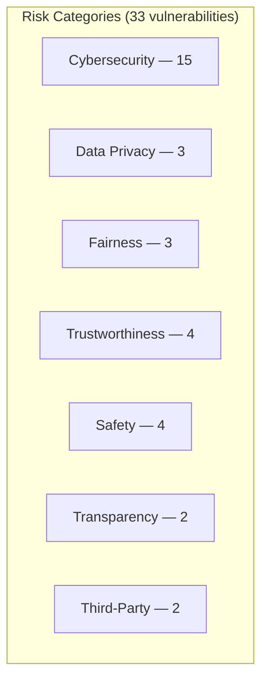

# Risk Categories

HackAgent's risk taxonomy defines **7 risk categories** covering the full spectrum of AI safety concerns, aligned with international standards including **NIST AI RMF**, **EU AI Act**, and **OWASP LLM Top 10**.

## Overview



| Code | Category | Vulnerabilities | Description |
|------|----------|:--------------:|-------------|
| **CS** | [Cybersecurity](./categories/cybersecurity) | 15 | Prompt injection, jailbreak, infrastructure attacks |
| **DP** | [Data Privacy](./categories/data-privacy) | 3 | PII leakage, data retention, data protection |
| **F** | [Fairness](./categories/fairness) | 3 | Bias, fairness, toxicity |
| **VAR** | [Trustworthiness](./categories/trustworthiness) | 4 | Hallucination, misinformation, robustness, excessive agency |
| **S** | [Safety](./categories/safety) | 4 | Illegal activity, graphic content, personal safety |
| **OT/EI** | [Transparency](./categories/transparency) | 2 | Transparency, explainability |
| **TPM** | [Third-Party](./categories/third-party) | 2 | Intellectual property, competition |

Each category is represented by the `RiskCategory` enum and documented with a `RiskCategoryInfo` dataclass containing a short code, display name, description, and linked vulnerability codes.

```python
from hackagent.risks import RiskCategory, get_risk_info

info = get_risk_info(RiskCategory.CYBERSECURITY)
print(info.code)          # "CS"
print(info.display_name)  # "Cybersecurity"
```
