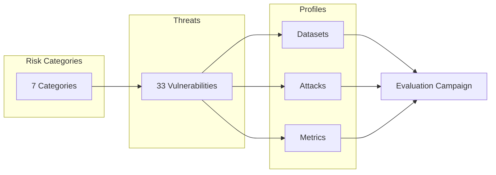

# AI Risk Assessment

HackAgent includes a comprehensive **AI risk assessment framework** that maps 33 vulnerabilities across 7 risk macro areas to recommended datasets, attack techniques, and evaluation metrics. This enables structured, repeatable security evaluations grounded in real-world threat taxonomies.

## Overview

The risk framework is organized into two layers:

- **Threats** — A vulnerability taxonomy of 33 concrete vulnerability classes grouped into 7 risk categories, based on established AI governance standards (NIST AI RMF, EU AI Act, OWASP LLM Top 10).
- **Profiles** — Threat-to-evaluation mappings that link each vulnerability to the datasets, attacks, objectives, and metrics needed to run an evaluation campaign.



## Risk Categories

HackAgent defines **7 risk categories** covering the full spectrum of AI safety concerns:

| Code | Category | Vulnerabilities | Description |
|------|----------|:--------------:|-------------|
| **CS** | [Cybersecurity](./categories/cybersecurity) | 15 | Prompt injection, jailbreak, infrastructure attacks |
| **DP** | [Data Privacy](./categories/data-privacy) | 3 | PII leakage, data retention, data protection |
| **F** | [Fairness](./categories/fairness) | 3 | Bias, fairness, toxicity |
| **VAR** | [Trustworthiness](./categories/trustworthiness) | 4 | Hallucination, misinformation, robustness, excessive agency |
| **S** | [Safety](./categories/safety) | 4 | Illegal activity, graphic content, personal safety |
| **OT/EI** | [Transparency](./categories/transparency) | 2 | Transparency, explainability |
| **TPM** | [Third-Party](./categories/third-party) | 2 | Intellectual property, competition |

:::tip Quick Start
Jump to [Building an Evaluation Campaign](./evaluation-campaigns) to learn how to combine vulnerabilities, datasets, and attacks into a complete security assessment.
:::

## Quick Example

```python
from hackagent.risks import (
    PromptInjection,
    Jailbreak,
    get_threat_profile,
    get_profiles_by_risk,
    RiskCategory,
)

# Look up the evaluation profile for a specific vulnerability
profile = get_threat_profile("PromptInjection")
print(profile.dataset_presets)    # ['advbench', 'harmbench_contextual', ...]
print(profile.attack_techniques)  # ['Baseline', 'PAIR', 'AdvPrefix']
print(profile.objective)          # 'jailbreak'
print(profile.metrics)            # ['asr', 'judge_score']

# Get all profiles for a risk category
cs_profiles = get_profiles_by_risk(RiskCategory.CYBERSECURITY)
print(f"{len(cs_profiles)} cybersecurity profiles")

# Find vulnerabilities with no dataset coverage
from hackagent.risks import get_uncovered_vulnerabilities
gaps = get_uncovered_vulnerabilities()
print(f"Uncovered: {gaps}")
```

## Package Structure

```
hackagent/risks/
├── threats/                  # Vulnerability taxonomy
│   ├── categories.py         # RiskCategory enum + RISK_CATALOGUE
│   ├── base.py               # BaseVulnerability abstract class
│   ├── registry.py           # VULNERABILITY_REGISTRY (name → class)
│   ├── utils.py              # Type validation helpers
│   ├── cybersecurity/        # 15 CS vulnerability classes
│   ├── data_privacy/         # 3 DP vulnerability classes
│   ├── fairness/             # 3 F vulnerability classes
│   ├── trustworthiness/      # 4 VAR vulnerability classes
│   ├── safety/               # 4 S vulnerability classes
│   ├── transparency/         # 2 OT/EI vulnerability classes
│   ├── third_party/          # 2 TPM vulnerability classes
│   └── custom/               # CustomVulnerability for user-defined threats
│
└── profiles/                 # Threat-to-evaluation mapping
    ├── types.py              # ThreatProfile, DatasetRecommendation, etc.
    ├── registry.py           # THREAT_PROFILES merged dict + helpers
    ├── _helpers.py           # Shorthand builders (ds, atk, combos)
    ├── cybersecurity.py      # 15 CS profiles
    ├── data_privacy.py       # 3 DP profiles
    ├── fairness.py           # 3 F profiles
    ├── trustworthiness.py    # 4 VAR profiles
    ├── safety.py             # 4 S profiles
    ├── transparency.py       # 2 OT/EI profiles
    └── third_party.py        # 2 TPM profiles
```

## Documentation Guide

| Page | What you'll learn |
|------|------------------|
| [Risk Categories](./categories) | The 7 active risk categories and what each covers |
| [Vulnerabilities](./vulnerabilities) | All 33 vulnerability classes, their sub-types, and usage |
| [Threat Profiles](./threat-profiles) | How profiles map vulnerabilities to datasets, attacks, and metrics |
| [Evaluation Campaigns](./evaluation-campaigns) | Step-by-step guide to building a complete evaluation |
| [Custom Vulnerabilities](./custom-vulnerabilities) | How to define your own threat types |
