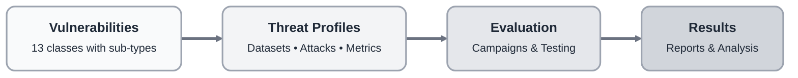

# AI Risks Assessment

HackAgent provides a comprehensive AI security testing framework with vulnerability classes, threat profiles, and evaluation campaigns for systematically testing LLM and agent security.

## Framework Architecture

<div style={{textAlign: 'center', margin: '2rem 0'}}>



</div>

## Vulnerabilities

import Tabs from '@theme/Tabs';
import TabItem from '@theme/TabItem';

<Tabs>
  <TabItem value="input" label="Input Layer" default>

- **PromptInjection** — Override system prompts
  *OWASP LLM01: Prompt Injection*

- **Jailbreak** — Bypass safety filters
  *OWASP LLM01: Prompt Injection*

- **InputManipulationAttack** — Encoding bypasses
  *OWASP LLM03: Training Data Poisoning*

- **SystemPromptLeakage** — Extract system instructions
  *OWASP LLM06: Sensitive Information Disclosure*

</TabItem>
  <TabItem value="model" label="Model Layer">

- **ModelEvasion** — Adversarial examples
  *MITRE ATLAS: AML.T0043 - Evade ML Model*

- **CraftAdversarialData** — Data poisoning
  *MITRE ATLAS: AML.T0018 - Backdoor ML Model*

</TabItem>
  <TabItem value="data" label="Data Layer">

- **SensitiveInformationDisclosure** — Training data extraction
  *OWASP LLM06: Sensitive Information Disclosure*

- **Misinformation** — Factual errors
  *OWASP LLM09: Misinformation*

</TabItem>
  <TabItem value="agent" label="Agent Layer">

- **ExcessiveAgency** — Unauthorized autonomy
  *OWASP LLM08: Excessive Agency*

- **MaliciousToolInvocation** — Tool misuse
  *OWASP LLM07: Insecure Plugin Design*

- **CredentialExposure** — Credential leakage
  *OWASP LLM06: Sensitive Information Disclosure*

- **PublicFacingApplicationExploitation** — API abuse
  *OWASP LLM05: Supply Chain Vulnerabilities*

- **VectorEmbeddingWeaknessesExploit** — Embedding attacks
  *MITRE ATLAS: AML.T0051 - LLM Prompt Injection*

</TabItem>
</Tabs>

Visit [Vulnerabilities](/risks/risk-categories) for complete reference including sub-types, usage examples, and import paths.

## Framework Components

<Tabs>
  <TabItem value="vulnerabilities" label="Vulnerabilities" default>

Each vulnerability class represents a specific AI security threat with typed sub-types:

```python
from hackagent.risks import PromptInjection
from hackagent.risks.prompt_injection.types import PromptInjectionType

# Instantiate with all sub-types (default)
vuln = PromptInjection()
print(vuln.get_values())
# ['direct_injection', 'indirect_injection', 'context_manipulation']

# Or specify particular sub-types
vuln = PromptInjection(types=[
    PromptInjectionType.DIRECT_INJECTION.value,
    PromptInjectionType.INDIRECT_INJECTION.value,
])
```

**Key Features:**
- Typed sub-types via enums
- Extensible base class
- Self-documenting with descriptions
- Registry-based lookup

</TabItem>
<TabItem value="profiles" label="Threat Profiles">

Profiles map vulnerabilities to evaluation parameters:

```python
from hackagent.risks.prompt_injection import PROMPT_INJECTION_PROFILE

profile = PROMPT_INJECTION_PROFILE

# Access recommendations
print(f"Name: {profile.name}")
print(f"Objective: {profile.objective}")
print(f"Primary datasets: {[d.preset for d in profile.primary_datasets]}")
print(f"Primary attacks: {[a.technique for a in profile.primary_attacks]}")
print(f"Metrics: {profile.metrics}")
```

**What Profiles Provide:**
- **Dataset Recommendations** — Curated datasets for testing this vulnerability
- **Attack Techniques** — Compatible attack methods with relevance levels
- **Metrics** — Appropriate evaluation metrics (ASR, judge scores, etc.)
- **Objectives** — Default attack objectives (jailbreak, harmful_behavior, policy_violation)

</TabItem>
<TabItem value="campaigns" label="Evaluation Campaigns">

Systematic security assessments:

```python
from hackagent import HackAgent
from hackagent.risks.jailbreak import JAILBREAK_PROFILE

agent = HackAgent(endpoint="...", name="my-agent")

# Campaign based on threat profile
for attack in JAILBREAK_PROFILE.primary_attacks:
    for dataset in JAILBREAK_PROFILE.primary_datasets:
        print(f"Running {attack.technique} on {dataset.preset}")

        result = agent.attack(
            attack_type=attack.technique.lower(),
            dataset=dataset.preset,
            objective=JAILBREAK_PROFILE.objective,
        )

        print(f"ASR: {result.get('asr', 'N/A')}")
```

</TabItem>
</Tabs>

## Documentation Guide

| Page | Description |
|------|-------------|
| [Vulnerabilities](/risks/risk-categories) | Vulnerability layers and organization patterns |
| [Vulnerability Reference](/risks/vulnerabilities) | Complete reference for all vulnerability classes, sub-types, and usage |
| [Threat Profiles](/risks/threat-profiles) | Dataset and attack mappings for each vulnerability |
| [Evaluation Campaigns](/risks/evaluation-campaigns) | Step-by-step guide to building comprehensive assessments |
| [Custom Vulnerabilities](/risks/custom-vulnerabilities) | Extend the framework with organization-specific threats |

## Related Resources

- [Datasets](/datasets) — 25+ curated security evaluation datasets
- [Attacks](/attacks) — Adversarial attack techniques (PAIR, AdvPrefix, Baseline)
- [CLI Reference](../cli/overview) — Command-line tools for automated testing
- [API Reference](../api-index) — Complete programmatic API documentation
