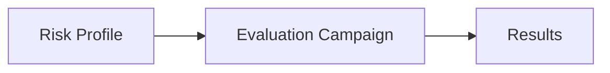

# AI Risks

HackAgent structures evaluation with three elements:

- **Risk Profile**: the set of one or more risk macro-categories (or micro-categories) to be tested.
- **Evaluation Campaign**: the executable evaluation plan (datasets, attacks, objective, metrics).
- **Results**: measured outcomes (for example ASR and judge score) used for tracking and comparison.

## Security Workflow

## Reference Risk Macro-Categories

The current taxonomy includes the following risk macro-categories:

1. Cybersecurity
2. Accountability & Transparency
3. Explainability & Interpretability
4. Fairness
5. Validity, Accuracy & Robustness
6. Data Governance
7. Data Privacy
8. People & Social Impact
9. Safety
10. Sustainability & Environmental Risk
11. Maintainability & AI Infrastructure
12. Third Party Management

## Micro-Category Example

- Jailbreak is a risk micro-category under **Cybersecurity**.

## What Is a Risk Profile

A risk profile is a set of one or more risk macro-categories (or micro-categories) that you want to test.

:::note
The defined categories are not intended to be mutually exclusive, nor to form an exhaustive partition of the risk space. Individual risks may span multiple categories, and overlaps are inherent to the taxonomy.
:::

## What Is Implemented Today

- **Implemented Risk Macro-Category**: Cybersecurity
- **Implemented Risk Micro-Category**: Jailbreak (under Cybersecurity)
- Current quick flow: [Evaluation Campaign](/getting-started/quick-security-scan)

## Core Concepts

| Concept | Meaning |
|---|---|
| **Risk Profile** | Defines the scope of the assessment as one or more macro-categories (or micro-categories). |
| **Evaluation Campaign** | Operationalizes the risk profile into an executable plan: datasets, attacks, objective, and metrics. |

For the currently implemented configuration, see [Jailbreak](/risks/vulnerabilities).

## Documentation Guide

| Page | Description |
|------|-------------|
| [Jailbreak](/risks/vulnerabilities) | Cybersecurity risk profile + Jailbreak micro-category reference |
| [Evaluation Campaign](/getting-started/quick-security-scan) | Run the 3 primary jailbreak attacks in sequence |

## Related Resources

- [Evaluation Tutorial](../getting-started/attack-tutorial) - Deep dive into PAIR attack configuration
- [Attacks](../attacks) - Full catalog of available attack techniques
- [CLI Reference](../cli/overview) - Command-line workflows for automated testing
- [SDK Reference](../api-index) - Programmatic API documentation
