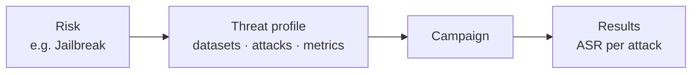

# AI Risks

Start here when you know **what** you are worried about rather than **which attack** to run. A <Term id="risk">risk</Term> names one way an AI system can fail. Its threat profile picks the datasets, attacks and metrics for testing it, and a <Term id="campaign">campaign</Term> runs them.


```mermaid
flowchart LR
    R["Risk<br/>e.g. Jailbreak"] --> P["Threat profile<br/>datasets · attacks · metrics"]
    P --> C["Campaign"] --> O["Results<br/>ASR per attack"]
```

## Built-in risks

[Jailbreak](./vulnerabilities/jailbreak.md) · [Prompt Injection](./vulnerabilities/prompt-injection.md) · [System Prompt Leakage](./vulnerabilities/system-prompt-leakage.md) · [Input Manipulation Attack](./vulnerabilities/input-manipulation-attack.md) · [Model Evasion](./vulnerabilities/model-evasion.md) · [Craft Adversarial Data](./vulnerabilities/craft-adversarial-data.md) · [Sensitive Information Disclosure](./vulnerabilities/sensitive-information-disclosure.md) · [Misinformation](./vulnerabilities/misinformation.md) · [Excessive Agency](./vulnerabilities/excessive-agency.md) · [Malicious Tool Invocation](./vulnerabilities/malicious-tool-invocation.md) · [Credential Exposure](./vulnerabilities/credential-exposure.md) · [Public-Facing Application Exploitation](./vulnerabilities/public-facing-application-exploitation.md) · [Vector and Embedding Weaknesses Exploit](./vulnerabilities/vector-embedding-weaknesses-exploit.md)

[Vulnerabilities](./vulnerabilities.md) describes each in one line. Retrieval-based systems also have a dedicated [indirect prompt injection](./indirect-prompt-injection.md) scenario, and you can [define your own risks](./custom-vulnerabilities.md).

<Modal trigger="How these fit the wider risk taxonomy" title="Risk macro-categories">

HackAgent's taxonomy has 12 macro-categories. The 13 built-in risks all sit in the first one, **Cybersecurity**, which is the only category implemented today.

1. Cybersecurity
2. Accountability & Transparency
3. Explainability & Interpretability
4. Fairness
5. Validity, Accuracy & Robustness
6. Data Governance
7. Data Privacy
8. People & Social Impact
9. Safety
10. Sustainability & Environmental Risk
11. Maintainability & AI Infrastructure
12. Third Party Management

The categories are neither exclusive nor exhaustive: one risk can span several.

</Modal>

## Test a risk

<Tabs groupId="interface">
<TabItem value="campaign" label="Campaign file" default>

A campaign runs the Jailbreak profile's primary attacks (h4rm3l, TAP and PAIR) on HarmBench, one of its recommended datasets. With `escalate`, TAP and PAIR only face the goals h4rm3l did not break:

```yaml title="jailbreak.yaml"
version: 1
campaign:
  name: Jailbreak profile
dataset:
  preset: harmbench
  selection:
    limit: 20
target:
  name: my-agent
  connection: {provider: vllm, type: OPENAI, endpoint: http://localhost:8000/v1}
attacks:
  - name: h4rm3l
  - name: tap
    roles:
      attacker: {name: llama3.2, connection: {provider: ollama, type: OLLAMA}}
  - name: pair
    roles:
      attacker: {name: llama3.2, connection: {provider: ollama, type: OLLAMA}}
evaluation:
  judges:
    - name: llama3.2
      connection: {provider: ollama, type: OLLAMA}
      scoring: {type: harmbench}
execution:
  escalate: true
```

```bash
hackagent campaign run jailbreak.yaml
```

</TabItem>
<TabItem value="sdk" label="SDK">

Every profile lists its recommended attacks and datasets; loop over the primary ones:

```python
from hackagent import HackAgent, Settings
from hackagent.catalog.risks.jailbreak import JAILBREAK_PROFILE

ollama = {"identifier": "llama3.2", "agent_type": "ollama",
          "endpoint": "http://localhost:11434"}
target = HackAgent(Settings.resolve()).target(
    "http://localhost:8000/v1", "openai", name="my-agent"
)
preset = "harmbench"  # one of JAILBREAK_PROFILE.primary_datasets
for attack in JAILBREAK_PROFILE.primary_attacks:
    results = target.hack(attack_config={
        "attack_type": attack.technique,
        "dataset": {"preset": preset, "limit": 20},
        "attacker": ollama,
        "judges": [{**ollama, "type": "harmbench"}],
    })
```

</TabItem>
</Tabs>

Each risk's page lists its datasets, attacks and metrics. [Evaluation campaigns](./evaluation-campaigns.md) covers larger runs: quick scans, full audits and targeted assessments. To run one, start with [Your first campaign](../getting-started/first-campaign.md); the [attack catalog](../reference/attacks/index.md) lists every technique.
