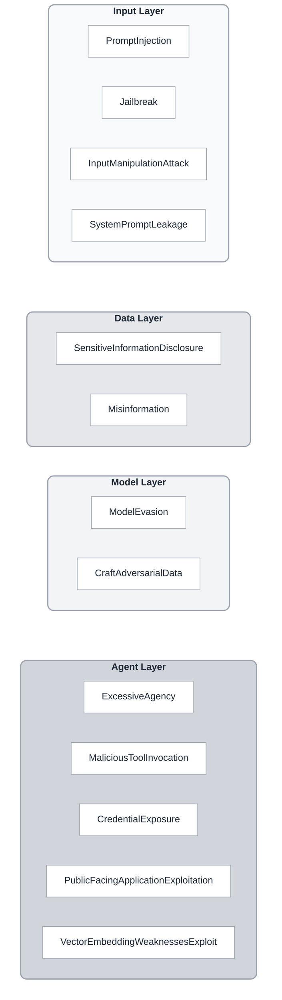

# Vulnerabilities

HackAgent's vulnerability framework is organized into four distinct layers, each targeting different attack surfaces of AI systems.

## Vulnerability Layers

<div style={{textAlign: 'center', margin: '2rem 0'}}>



</div>

## Organization Patterns

Choose how to group vulnerabilities based on your needs:

import Tabs from '@theme/Tabs';
import TabItem from '@theme/TabItem';

<Tabs>
  <TabItem value="attack-surface" label="By Attack Surface" default>

Group vulnerabilities based on where they target your system:

**Input Layer**
- PromptInjection
- Jailbreak
- InputManipulationAttack
- SystemPromptLeakage

**Model Layer**
- ModelEvasion
- CraftAdversarialData

**Data Layer**
- SensitiveInformationDisclosure
- Misinformation

**Agent Layer**
- ExcessiveAgency
- MaliciousToolInvocation
- CredentialExposure
- PublicFacingApplicationExploitation
- VectorEmbeddingWeaknessesExploit

</TabItem>
<TabItem value="severity" label="By Severity">

Organize by potential business impact:

```python
from hackagent.risks import *

CRITICAL = [
    CredentialExposure,
    SystemPromptLeakage,
    ExcessiveAgency,
    MaliciousToolInvocation,
]

HIGH = [
    PromptInjection,
    Jailbreak,
    SensitiveInformationDisclosure,
    PublicFacingApplicationExploitation,
]

MEDIUM = [
    ModelEvasion,
    CraftAdversarialData,
    InputManipulationAttack,
    VectorEmbeddingWeaknessesExploit,
]

LOW = [
    Misinformation,
]
```

  </TabItem>
  <TabItem value="technique" label="By Attack Technique">

Group by the attack methods they're vulnerable to:

```python
from hackagent.risks import *

# Adversarial ML Attacks
ADVERSARIAL_ML = [
    ModelEvasion,
    CraftAdversarialData,
    VectorEmbeddingWeaknessesExploit,
]

# Prompt Manipulation
PROMPT_ATTACKS = [
    PromptInjection,
    Jailbreak,
    SystemPromptLeakage,
]

# Agent Exploitation
AGENT_ATTACKS = [
    ExcessiveAgency,
    MaliciousToolInvocation,
    PublicFacingApplicationExploitation,
]

# Data & Encoding Attacks
DATA_ATTACKS = [
    InputManipulationAttack,
    SensitiveInformationDisclosure,
    CredentialExposure,
]

# Content Generation Risks
CONTENT_RISKS = [
    Misinformation,
]
```

  </TabItem>
  <TabItem value="compliance" label="By Compliance Framework">

Map to regulatory requirements:

**OWASP Top 10 for LLMs**
- LLM01: PromptInjection
- LLM02: SensitiveInformationDisclosure
- LLM03: VectorEmbeddingWeaknessesExploit (Supply Chain)
- LLM04: ModelEvasion (Model Denial of Service)
- LLM06: SensitiveInformationDisclosure
- LLM07: InputManipulationAttack
- LLM08: ExcessiveAgency
- LLM09: MaliciousToolInvocation
- LLM10: Misinformation

**EU AI Act (High-Risk Systems)**
- Jailbreak (Safety Requirements)
- Misinformation (Accuracy Requirements)
- SensitiveInformationDisclosure (Data Governance)
- ExcessiveAgency (Human Oversight)
- CredentialExposure (Security)

**NIST AI RMF**
- **GOVERN**: CredentialExposure, ExcessiveAgency
- **MAP**: ModelEvasion, CraftAdversarialData
- **MEASURE**: Misinformation, SensitiveInformationDisclosure
- **MANAGE**: All vulnerabilities with threat profiles

</TabItem>
</Tabs>

## Industry-Specific Views

<Tabs>
  <TabItem value="healthcare" label="Healthcare AI" default>

```python
HEALTHCARE_PRIORITY = {
    "PHI_Protection": [
        SensitiveInformationDisclosure,
        SystemPromptLeakage,
        CredentialExposure,
    ],
    "Clinical_Safety": [
        Misinformation,
        ExcessiveAgency,
        Jailbreak,
    ],
    "Diagnostic_Robustness": [
        ModelEvasion,
        CraftAdversarialData,
    ],
}
```

  </TabItem>
  <TabItem value="financial" label="Financial Services">

```python
FINANCIAL_PRIORITY = {
    "Data_Security": [
        CredentialExposure,
        SensitiveInformationDisclosure,
        SystemPromptLeakage,
    ],
    "Transaction_Integrity": [
        ExcessiveAgency,
        MaliciousToolInvocation,
        PromptInjection,
    ],
    "Regulatory_Compliance": [
        Misinformation,
        PublicFacingApplicationExploitation,
    ],
}
```

  </TabItem>
  <TabItem value="support" label="Customer Support">

```python
SUPPORT_PRIORITY = {
    "Brand_Safety": [
        Jailbreak,
        Misinformation,
        PromptInjection,
    ],
    "Data_Privacy": [
        SensitiveInformationDisclosure,
        SystemPromptLeakage,
    ],
    "Service_Reliability": [
        ExcessiveAgency,
        ModelEvasion,
    ],
}
```

  </TabItem>
</Tabs>

## Creating Custom Groups

Define your own vulnerability groups based on your organization's needs:

```python
from hackagent.risks import VULNERABILITY_REGISTRY

class ThreatModel:
    """Custom threat model for your organization."""

    def __init__(self, name: str, vulnerabilities: list[str]):
        self.name = name
        self.vulnerabilities = [
            VULNERABILITY_REGISTRY[v] for v in vulnerabilities
        ]

    def create_campaign(self, agent):
        """Run evaluation campaign for this threat model."""
        results = {}
        for vuln_class in self.vulnerabilities:
            vuln = vuln_class()
            # Get threat profile and run evaluation
            # ... implementation
        return results

# Define your custom threat models
web_app_threats = ThreatModel(
    name="Web Application AI",
    vulnerabilities=[
        "PromptInjection",
        "Jailbreak",
        "PublicFacingApplicationExploitation",
        "InputManipulationAttack",
    ]
)

rag_pipeline_threats = ThreatModel(
    name="RAG Pipeline",
    vulnerabilities=[
        "VectorEmbeddingWeaknessesExploit",
        "PromptInjection",
        "SensitiveInformationDisclosure",
        "Misinformation",
    ]
)
```

## Evaluation Campaign Templates

<Tabs>
  <TabItem value="quick" label="Quick Scan" default>

Test the most common vulnerabilities first:

```python
from hackagent import HackAgent
from hackagent.risks import (
    PromptInjection,
    Jailbreak,
    SensitiveInformationDisclosure,
    ExcessiveAgency,
)

QUICK_SCAN = [
    PromptInjection,
    Jailbreak,
    SensitiveInformationDisclosure,
    ExcessiveAgency,
]

agent = HackAgent(endpoint="...", name="my-agent")

for vuln_class in QUICK_SCAN:
    vuln = vuln_class()
    print(f"Testing {vuln.name}...")
    # Run evaluation
```

  </TabItem>
  <TabItem value="comprehensive" label="Comprehensive Audit">

Full security assessment:

```python
from hackagent.risks import get_all_vulnerability_names, VULNERABILITY_REGISTRY

all_vuln_names = get_all_vulnerability_names()

for name in all_vuln_names:
    vuln_class = VULNERABILITY_REGISTRY[name]
    vuln = vuln_class()
    print(f"Evaluating {vuln.name}...")
    # Run comprehensive tests
```

  </TabItem>
  <TabItem value="targeted" label="Targeted Assessment">

Focus on specific attack surfaces:

```python
# Example: RAG-specific evaluation
from hackagent.risks import (
    VectorEmbeddingWeaknessesExploit,
    PromptInjection,
    SensitiveInformationDisclosure,
)

RAG_FOCUSED = [
    VectorEmbeddingWeaknessesExploit,
    PromptInjection,
    SensitiveInformationDisclosure,
]
```

  </TabItem>
</Tabs>

## Best Practices

:::tip Start with Your Threat Model
Don't test all 13 vulnerabilities at once. Start by identifying which ones are most relevant to your use case, then expand your coverage over time.
:::

:::info Prioritize by Impact
Organize vulnerabilities based on potential business impact rather than technical complexity. A critical credential leak is more urgent than a minor model evasion.
:::

:::warning Regular Reassessment
Your threat landscape changes as your AI system evolves. Regularly review and update your vulnerability groupings.
:::

## Next Steps

- [Vulnerabilities](./vulnerabilities) — Complete reference for all 13 vulnerability classes
- [Threat Profiles](./threat-profiles) — Understand dataset and attack mappings
- [Evaluation Campaigns](./evaluation-campaigns) — Build comprehensive security assessments
- [Custom Vulnerabilities](./custom-vulnerabilities) — Extend with organization-specific threats
