# Risk Categories

HackAgent's risk taxonomy defines **13 macro areas** of AI risk, aligned with international standards including **NIST AI RMF**, **EU AI Act**, and **OWASP LLM Top 10**. Seven of these categories have active vulnerability implementations with corresponding evaluation profiles.

## Category Overview

```mermaid
graph TD
    subgraph "Active Categories (33 vulnerabilities)"
        CS[🔒 Cybersecurity - 15]
        DP[🔐 Data Privacy - 3]
        F[⚖️ Fairness - 3]
        VAR[✅ Trustworthiness - 4]
        S[🛡️ Safety - 4]
        OT[🔍 Transparency - 2]
        TPM[🤝 Third-Party - 2]
    end
```



Each category is represented by the `RiskCategory` enum and documented with a `RiskCategoryInfo` dataclass containing a short code, display name, description, and linked vulnerability codes.

```python
from hackagent.risks import RiskCategory, get_risk_info

info = get_risk_info(RiskCategory.CYBERSECURITY)
print(info.code)          # "CS"
print(info.display_name)  # "Cybersecurity"
```

---

## Cybersecurity (CS)

**Code:** `CS` · **Enum:** `RiskCategory.CYBERSECURITY` · **Vulnerabilities:** 15

Covers threats where adversaries exploit LLM interfaces or infrastructure to bypass safety mechanisms, execute unauthorized actions, or exfiltrate data.

| Vulnerability | Description | Sub-types |
|--------------|-------------|-----------|
| **PromptInjection** | Injected instructions override system prompts | direct, indirect, multi_turn |
| **PromptLeakage** | Model leaks system prompts, secrets, or guard configs | system_prompt, secrets, guard_config |
| **Jailbreak** | Multi-turn, roleplay, encoding, and authority-based bypass | roleplay, encoding, authority |
| **InsecureOutput** | Unescaped code, excessive info, or sensitive data in responses | code_injection, data_leak, format_abuse |
| **InsecurePlugin** | Untrusted plugin execution and privilege escalation | data_exfiltration, privilege_escalation, untrusted_execution |
| **SupplyChain** | Model/data poisoning and dependency vulnerabilities | model_poisoning, data_poisoning, dependency_attack |
| **SSRF** | Internal service access, cloud metadata, data exfiltration | internal_access, cloud_metadata, data_exfiltration |
| **SQLInjection** | Blind, union-based, and error-based SQL injection | blind, union_based, error_based |
| **ShellInjection** | Command injection and shell escape sequences | command_injection, system_command, shell_escape |
| **DebugAccess** | Debug endpoint exposure and internal state disclosure | endpoint_exposure, verbose_errors, state_disclosure |
| **RBAC** | Role bypass and privilege escalation | role_bypass, privilege_escalation, role_assumption |
| **BFLA** | Function-level authorization bypass | function_bypass, privilege_escalation, admin_access |
| **BOLA** | Object-level access bypass and cross-customer data access | object_access, cross_customer, data_manipulation |
| **CredentialExposure** | Hardcoded credentials, token leakage, misconfigured access | hardcoded, token_leak, misconfigured |
| **SensitiveInfoDisclosure** | Training data extraction, architecture disclosure | training_data, architecture, config_leak |

:::info Attack Coverage
Most cybersecurity vulnerabilities support the full attack suite (Baseline + PAIR + AdvPrefix). Key datasets include **advbench**, **harmbench**, **jailbreakbench**, **strongreject**, and **wmdp_cyber**.
:::

---

## Data Privacy (DP)

**Code:** `DP` · **Enum:** `RiskCategory.DATA_PRIVACY` · **Vulnerabilities:** 3

Covers threats related to the unauthorized exposure, retention, or mishandling of personal and sensitive data.

| Vulnerability | Description | Sub-types |
|--------------|-------------|-----------|
| **PIILeakage** | Direct PII disclosure, session leaks, social manipulation | direct_disclosure, session_leak, social_manipulation |
| **DataRetention** | Excessive retention, unlawful storage, failed deletion | excessive_retention, unlawful_storage, failed_deletion |
| **DataProtection** | Unencrypted transmission, weak anonymisation, access control failures | unencrypted, weak_anonymisation, access_control |

:::note
DataRetention and DataProtection currently have **no standard public dataset** and require custom goals for evaluation. PIILeakage can be tested with **donotanswer** and **beavertails** datasets.
:::

---

## Fairness (F)

**Code:** `F` · **Enum:** `RiskCategory.FAIRNESS` · **Vulnerabilities:** 3

Covers threats where AI systems produce discriminatory, biased, or toxic outputs that harm specific groups.

| Vulnerability | Description | Sub-types |
|--------------|-------------|-----------|
| **Bias** | Racial, gender, religious, and political bias | race, gender, religion, politics |
| **Fairness** | Stereotyping, subgroup impact, bias drift | stereotyping, subgroup_impact, bias_drift, inconsistent_treatment |
| **Toxicity** | Insults, profanity, threats, and mockery | insults, profanity, threats, mockery |

:::info Key Datasets
**discrim_eval** (9.4K Anthropic decision prompts) is the primary dataset for bias and fairness testing. **toxicchat** (10K real user prompts) and **donotanswer** are primary for toxicity.
:::

---

## Trustworthiness (VAR)

**Code:** `VAR` · **Enum:** `RiskCategory.VALIDITY_ACCURACY_ROBUSTNESS` · **Vulnerabilities:** 4

Covers threats to model reliability — factual accuracy, resistance to manipulation, and appropriate levels of autonomy.

| Vulnerability | Description | Sub-types |
|--------------|-------------|-----------|
| **Hallucination** | Factual fabrication, source fabrication, context hallucination | factual, source, context |
| **Misinformation** | Factual errors, unsupported claims, expertise misrepresentation | factual_errors, unsupported_claims, expertise_misrepresentation |
| **Robustness** | Input over-reliance, hijacking, adversarial perturbation | over_reliance, hijacking, perturbation |
| **ExcessiveAgency** | Excess functionality, permissions, and autonomy | excess_functionality, excess_permissions, excess_autonomy |

:::info Key Datasets
**truthfulqa** is the primary benchmark for hallucination and misinformation. **xstest** and **coconot** test robustness. **agentharm** tests excessive agency in agentic systems.
:::

---

## Safety (S)

**Code:** `S` · **Enum:** `RiskCategory.SAFETY` · **Vulnerabilities:** 4

Covers threats where AI systems generate content that could cause real-world harm — from criminal planning to graphic violence.

| Vulnerability | Description | Sub-types |
|--------------|-------------|-----------|
| **IllegalActivity** | Criminal planning, weapons, drug production, fraud/scam | criminal_planning, weapons, drugs, fraud |
| **GraphicContent** | Violence, sexual content, self-harm generation | violence, sexual, self_harm |
| **PersonalSafety** | Dangerous instructions, stalking/harassment, child exploitation | dangerous_instructions, stalking, child_exploitation |
| **AutonomousOversight** | Missing human override, unmonitored actions, cascading failures | missing_override, unmonitored, cascading |

:::info Key Datasets
Safety has the richest dataset coverage: **harmbench**, **strongreject**, **beavertails**, **saladbench**, **simplesafetytests**, **wmdp_bio**, **wmdp_chem**, **harmfulqa**, and **agentharm**.
:::

---

## Transparency & Explainability (OT/EI)

**Code:** `OT` / `EI` · **Enum:** `RiskCategory.OPERABILITY_TRANSPARENCY` / `RiskCategory.EXPLAINABILITY_INTERPRETABILITY` · **Vulnerabilities:** 2

Covers threats where AI systems fail to adequately disclose their nature, reasoning, or limitations.

| Vulnerability | Description | Sub-types |
|--------------|-------------|-----------|
| **Transparency** | Insufficient disclosure, missing provenance, policy violations | insufficient_disclosure, missing_provenance, hidden_limitations, no_ai_disclosure, policy_violation |
| **Explainability** | Opaque decisions, meaningless explanations, confidence erosion | opaque_decisions, meaningless_explanations, no_uncertainty, selective_explanations, confidence_erosion |

:::note
Both currently have **no standard public dataset** and require custom goals for evaluation.
:::

---

## Third-Party Management (TPM)

**Code:** `TPM` · **Enum:** `RiskCategory.THIRD_PARTY_MANAGEMENT` · **Vulnerabilities:** 2

Covers threats arising from intellectual property violations and anti-competitive behavior in AI outputs.

| Vulnerability | Description | Sub-types |
|--------------|-------------|-----------|
| **IntellectualProperty** | Copyright violations, trademark infringement, imitation | copyright, trademark, imitation, trade_secret |
| **Competition** | Competitor denigration, market manipulation, strategy leaks | denigration, market_manipulation, strategy_leak |

:::note
Both currently have **no standard public dataset** and require custom goals for evaluation.
:::

---

## Additional Risk Areas

The following 6 macro areas are defined in the `RiskCategory` enum but do not yet have vulnerability implementations:

| Code | Category | Status |
|------|----------|--------|
| DG | Data Governance | Planned |
| PDI | People & Digital Impact | Planned |
| LE | Legality | Planned |
| SEI | Sustainability & Environmental Impact | Planned |
| NDB | Non-Discrimination & Bias | Merged into Fairness |

These can be extended by creating custom vulnerability classes. See [Custom Vulnerabilities](./custom-vulnerabilities).

---

## Using the Catalogue

```python
from hackagent.risks import RISK_CATALOGUE, get_risk_info, RiskCategory

# List all 13 macro areas
for info in RISK_CATALOGUE:
    print(f"[{info.code}] {info.display_name}: {info.description}")

# Get details for a specific category
cs = get_risk_info(RiskCategory.CYBERSECURITY)
print(cs.vulnerability_codes)  # List of vulnerability codes in this category
```
