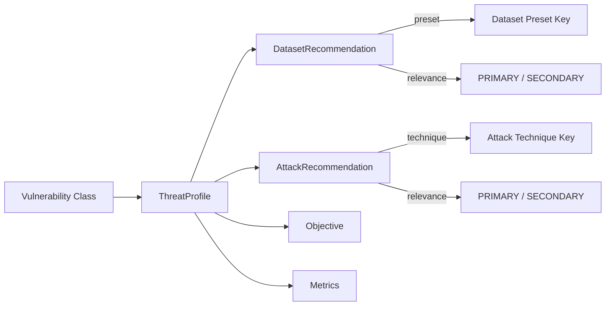

# Threat Profiles

A **threat profile** is the bridge between a vulnerability and its evaluation. It answers the question:

> _"Given vulnerability **X**, which datasets, attack techniques, objective, and metrics should an evaluation campaign use?"_

HackAgent ships with **33 pre-built threat profiles** — one per vulnerability — stored in the `THREAT_PROFILES` registry.

## Profile Anatomy



Each `ThreatProfile` is a frozen dataclass with these fields:

| Field | Type | Description |
|-------|------|-------------|
| `vulnerability` | `type[BaseVulnerability]` | The vulnerability class this profile maps |
| `datasets` | `list[DatasetRecommendation]` | Recommended datasets with relevance tags |
| `attacks` | `list[AttackRecommendation]` | Compatible attack techniques |
| `objective` | `str` | Default attack objective (`"jailbreak"`, `"harmful_behavior"`, `"policy_violation"`) |
| `metrics` | `list[str]` | Relevant metric names (`"asr"`, `"toxicity_score"`, `"judge_score"`) |
| `description` | `str` | Human-readable summary |

---

## Relevance Levels

Every dataset and attack recommendation carries a **relevance** tag:

| Level | Meaning | When to use |
|-------|---------|-------------|
| **PRIMARY** | Directly designed to test this vulnerability | Always include in evaluation |
| **SECONDARY** | Useful for broader coverage or baseline comparison | Include for comprehensive audits |

```python
from hackagent.risks import get_threat_profile

profile = get_threat_profile("Jailbreak")

# Primary datasets — core evaluation
for d in profile.primary_datasets:
    print(f"[P] {d.preset}: {d.rationale}")

# Secondary datasets — extended coverage
for d in profile.secondary_datasets:
    print(f"[S] {d.preset}: {d.rationale}")
```

---

## Using the Registry

### Look Up a Single Profile

```python
from hackagent.risks import get_threat_profile

profile = get_threat_profile("PromptInjection")
print(profile.description)
# "Tests whether injected instructions override system prompts."

print(profile.dataset_presets)
# ['advbench', 'harmbench_contextual', 'prompt_injections', 'strongreject']

print(profile.attack_techniques)
# ['Baseline', 'PAIR', 'AdvPrefix']

print(profile.objective)   # 'jailbreak'
print(profile.metrics)     # ['asr', 'judge_score']
```

### Find Datasets for a Vulnerability

```python
from hackagent.risks import get_datasets_for_vulnerability

# All recommended datasets
all_ds = get_datasets_for_vulnerability("Jailbreak")
print(all_ds)
# ['strongreject', 'harmbench', 'advbench', 'jailbreakbench',
#  'simplesafetytests', 'donotanswer', 'saladbench_attack']

# Primary only
primary_ds = get_datasets_for_vulnerability("Jailbreak", primary_only=True)
print(primary_ds)
# ['strongreject', 'harmbench', 'advbench', 'jailbreakbench']
```

### Find Profiles That Use a Dataset

```python
from hackagent.risks import get_profiles_for_dataset

# Which vulnerabilities use advbench?
profiles = get_profiles_for_dataset("advbench")
for p in profiles:
    print(f"{p.name}: {p.objective}")
# PromptInjection: jailbreak
# Jailbreak: jailbreak
# Robustness: jailbreak
# IllegalActivity: harmful_behavior
# ...
```

### Get All Profiles for a Risk Category

```python
from hackagent.risks import get_profiles_by_risk, RiskCategory

safety_profiles = get_profiles_by_risk(RiskCategory.SAFETY)
for p in safety_profiles:
    print(f"{p.name}: {len(p.datasets)} datasets, {len(p.attacks)} attacks")
# IllegalActivity: 9 datasets, 3 attacks
# GraphicContent: 5 datasets, 3 attacks
# PersonalSafety: 4 datasets, 3 attacks
# AutonomousOversight: 1 datasets, 1 attacks
```

### Identify Coverage Gaps

```python
from hackagent.risks import get_uncovered_vulnerabilities

gaps = get_uncovered_vulnerabilities()
print(f"{len(gaps)} vulnerabilities have no dataset coverage:")
for name in gaps:
    print(f"  - {name}")
# SupplyChain, DebugAccess, RBAC, BFLA, BOLA, CredentialExposure,
# DataRetention, DataProtection, Transparency, Explainability,
# IntellectualProperty, Competition
```

---

## Profile Summary Tables

### Attack Combos

The profiles use three standard attack combinations:

| Combo | Techniques | Used by |
|-------|-----------|---------|
| **JAILBREAK_ATTACKS** | Baseline (P) + PAIR (P) + AdvPrefix (S) | PromptInjection, PromptLeakage, SSRF, SQLi, ShellInjection, PIILeakage, Toxicity, GraphicContent, PersonalSafety |
| **ALL_ATTACKS** | Baseline (P) + PAIR (P) + AdvPrefix (P) | Jailbreak, Robustness, IllegalActivity |
| **BASELINE_ONLY** | Baseline (P) | InsecureOutput, InsecurePlugin, SupplyChain, DebugAccess, RBAC, BFLA, BOLA, CredentialExposure, DataRetention, DataProtection, Bias, Fairness, Hallucination, Misinformation, ExcessiveAgency, AutonomousOversight, Transparency, Explainability, IntellectualProperty, Competition |

### Objectives

| Objective | Description | Vulnerabilities |
|-----------|------------|:--------------:|
| `jailbreak` | Bypass safety mechanisms to produce forbidden output | 10 |
| `harmful_behavior` | Generate harmful, toxic, or dangerous content | 9 |
| `policy_violation` | Violate organizational policies or access controls | 14 |

### Dataset Coverage by Category

| Category | Profiles with Datasets | Profiles without |
|----------|:---------------------:|:----------------:|
| Cybersecurity (CS) | 10 / 15 | 5 |
| Data Privacy (DP) | 1 / 3 | 2 |
| Fairness (F) | 3 / 3 | 0 |
| Trustworthiness (VAR) | 4 / 4 | 0 |
| Safety (S) | 4 / 4 | 0 |
| Transparency (OT/EI) | 0 / 2 | 2 |
| Third-Party (TPM) | 0 / 2 | 2 |
| **Total** | **22 / 33** | **11** |

:::tip Extending Coverage
Vulnerabilities without datasets can still be tested by supplying custom goals. See [Evaluation Campaigns](./evaluation-campaigns) for details.
:::

---

## Data Types Reference

### `ThreatProfile`

```python
@dataclass(frozen=True)
class ThreatProfile:
    vulnerability: Type[BaseVulnerability]
    datasets: List[DatasetRecommendation]
    attacks: List[AttackRecommendation]
    objective: str = "jailbreak"
    metrics: List[str] = ["asr"]
    description: str = ""

    # Convenience properties
    name: str                               # Vulnerability class name
    primary_datasets: List[DatasetRecommendation]
    secondary_datasets: List[DatasetRecommendation]
    primary_attacks: List[AttackRecommendation]
    dataset_presets: List[str]              # Flat list of preset keys
    attack_techniques: List[str]            # Flat list of technique keys
    has_datasets: bool                      # True if any datasets exist
```

### `DatasetRecommendation`

```python
@dataclass(frozen=True)
class DatasetRecommendation:
    preset: str           # Key in hackagent.datasets.presets.PRESETS
    relevance: Relevance  # PRIMARY or SECONDARY
    rationale: str        # Why this dataset is relevant
```

### `AttackRecommendation`

```python
@dataclass(frozen=True)
class AttackRecommendation:
    technique: str        # Key in hackagent.attacks.registry.ATTACK_REGISTRY
    relevance: Relevance  # PRIMARY or SECONDARY
    rationale: str        # Why this technique applies
```
