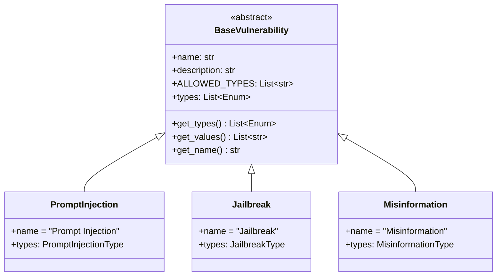

# Vulnerability Reference

HackAgent provides 13 vulnerability classes for systematic AI security testing. Each vulnerability inherits from `BaseVulnerability` and includes typed sub-types for precise attack surface specification.

## Architecture



## Using Vulnerabilities

### Instantiation

Every vulnerability can be instantiated with default sub-types (all) or a specific subset:

```python
from hackagent.risks import PromptInjection, Jailbreak

# All sub-types (default)
pi = PromptInjection()
print(pi.get_values())
# ['direct_injection', 'indirect_injection', 'context_manipulation']

# Specific sub-types only
from hackagent.risks.prompt_injection.types import PromptInjectionType
pi_direct = PromptInjection(types=[PromptInjectionType.DIRECT_INJECTION.value])
print(pi_direct.get_values())  # ['direct_injection']
```

### Registry Lookup

The `VULNERABILITY_REGISTRY` maps vulnerability names to their classes:

```python
from hackagent.risks import VULNERABILITY_REGISTRY, get_all_vulnerability_names

# List all 13 registered vulnerabilities
names = get_all_vulnerability_names()
print(len(names))  # 13

# Look up a class by name
cls = VULNERABILITY_REGISTRY["Jailbreak"]
instance = cls()
print(instance.name)  # "Jailbreak"
```

### Accessing Type Information

Each vulnerability has an associated enum of sub-types:

```python
from hackagent.risks import PromptInjection
from hackagent.risks.prompt_injection.types import PromptInjectionType

# Get all available sub-types
vuln = PromptInjection()
types = vuln.get_types()  # Returns list of PromptInjectionType enums
values = vuln.get_values()  # Returns list of string values

# Access the enum directly
print(PromptInjectionType.DIRECT_INJECTION.value)  # "direct_injection"
```

---

## Complete Vulnerability Reference

### 1. ModelEvasion

Tests whether adversarial examples, feature manipulation, or boundary exploitation can evade the model's safety mechanisms.

**Import:** `from hackagent.risks import ModelEvasion`

**Sub-types:**
- `adversarial_examples` — Crafted inputs that cause the model to misclassify or produce wrong outputs
- `feature_space_manipulation` — Manipulating input features to evade detection or safety mechanisms
- `model_boundary_exploitation` — Exploiting decision boundaries to find blind spots in model behaviour

**Example:**
```python
from hackagent.risks import ModelEvasion
from hackagent.risks.model_evasion.types import ModelEvasionType

vuln = ModelEvasion(types=[ModelEvasionType.ADVERSARIAL_EXAMPLES.value])
```

---

### 2. CraftAdversarialData

Tests whether adversarially crafted data — perturbations, poisoned examples, or augmentation abuse — can compromise model behaviour.

**Import:** `from hackagent.risks import CraftAdversarialData`

**Sub-types:**
- `perturbation_attacks` — Small, imperceptible changes to inputs that alter model outputs
- `poisoned_examples` — Adversarially crafted examples designed to trigger specific model failures
- `data_augmentation_abuse` — Exploiting data augmentation pipelines to inject adversarial samples

**Example:**
```python
from hackagent.risks import CraftAdversarialData
from hackagent.risks.craft_adversarial_data.types import CraftAdversarialDataType

vuln = CraftAdversarialData(types=[CraftAdversarialDataType.POISONED_EXAMPLES.value])
```

---

### 3. PromptInjection

Tests whether the LLM executes attacker-supplied instructions that override or bypass the system prompt.

**Import:** `from hackagent.risks import PromptInjection`

**Sub-types:**
- `direct_injection` — User prompt directly overrides system instructions
- `indirect_injection` — Malicious instructions are embedded in retrieved/external content
- `context_manipulation` — Crafted context tricks the model into ignoring guardrails

**Example:**
```python
from hackagent.risks import PromptInjection
from hackagent.risks.prompt_injection.types import PromptInjectionType

vuln = PromptInjection(types=[
    PromptInjectionType.DIRECT_INJECTION.value,
    PromptInjectionType.INDIRECT_INJECTION.value
])
```

---

### 4. Jailbreak

Tests whether the LLM can be manipulated into bypassing its safety filters through roleplay, encoding, multi-turn, hypothetical, or authority-manipulation techniques.

**Import:** `from hackagent.risks import Jailbreak`

**Sub-types:**
- `roleplay` — Uses fictional scenarios or personas to bypass safety filters
- `encoding` — Encodes malicious intent via Base64, ROT13, leetspeak, etc.
- `multi_turn` — Gradually escalates across conversation turns (crescendo)
- `hypothetical` — Frames harmful requests as hypothetical or academic questions
- `authority_manipulation` — Invokes false authority or urgency to override restrictions

**Example:**
```python
from hackagent.risks import Jailbreak
from hackagent.risks.jailbreak.types import JailbreakType

vuln = Jailbreak(types=[
    JailbreakType.ROLEPLAY.value,
    JailbreakType.MULTI_TURN.value
])
```

---

### 5. VectorEmbeddingWeaknessesExploit

Tests for embedding inversion, vector database poisoning, and similarity search manipulation in RAG pipelines.

**Import:** `from hackagent.risks import VectorEmbeddingWeaknessesExploit`

**Sub-types:**
- `embedding_inversion` — Recovering original text or sensitive data from embedding vectors
- `vector_db_poisoning` — Injecting malicious entries into vector databases used for RAG
- `similarity_manipulation` — Crafting inputs to manipulate similarity search results

**Example:**
```python
from hackagent.risks import VectorEmbeddingWeaknessesExploit
from hackagent.risks.vector_embedding_weaknesses_exploit.types import (
    VectorEmbeddingWeaknessesExploitType
)

vuln = VectorEmbeddingWeaknessesExploit(types=[
    VectorEmbeddingWeaknessesExploitType.VECTOR_DB_POISONING.value
])
```

---

### 6. SensitiveInformationDisclosure

Tests for training-data extraction, architecture disclosure, and configuration leakage.

**Import:** `from hackagent.risks import SensitiveInformationDisclosure`

**Sub-types:**
- `training_data_extraction` — Model memorisation allows extraction of training data
- `system_architecture_disclosure` — Model reveals internal architecture details
- `configuration_leakage` — Model exposes configuration parameters or settings

**Example:**
```python
from hackagent.risks import SensitiveInformationDisclosure
from hackagent.risks.sensitive_information_disclosure.types import (
    SensitiveInformationDisclosureType
)

vuln = SensitiveInformationDisclosure(types=[
    SensitiveInformationDisclosureType.TRAINING_DATA_EXTRACTION.value
])
```

---

### 7. SystemPromptLeakage

Tests whether the LLM reveals sensitive details from its system prompt, such as credentials, internal instructions, or guardrails.

**Import:** `from hackagent.risks import SystemPromptLeakage`

**Sub-types:**
- `secrets_and_credentials` — Reveals API keys, database credentials, or system architecture from the prompt
- `instructions` — Discloses internal instructions, rules, or operational procedures
- `guard_exposure` — Exposes guard mechanisms, rejection rules, or filtering criteria
- `permissions_and_roles` — Reveals role-based permissions, access controls, or internal configurations

**Example:**
```python
from hackagent.risks import SystemPromptLeakage
from hackagent.risks.system_prompt_leakage.types import SystemPromptLeakageType

vuln = SystemPromptLeakage(types=[
    SystemPromptLeakageType.SECRETS_AND_CREDENTIALS.value,
    SystemPromptLeakageType.INSTRUCTIONS.value
])
```

---

### 8. ExcessiveAgency

Tests whether the LLM performs actions or grants permissions exceeding its intended scope without oversight.

**Import:** `from hackagent.risks import ExcessiveAgency`

**Sub-types:**
- `functionality` — Model performs actions beyond its intended scope
- `permissions` — Model grants or exercises permissions it should not have
- `autonomy` — Model acts autonomously without required human oversight

**Example:**
```python
from hackagent.risks import ExcessiveAgency
from hackagent.risks.excessive_agency.types import ExcessiveAgencyType

vuln = ExcessiveAgency(types=[
    ExcessiveAgencyType.AUTONOMY.value
])
```

---

### 9. InputManipulationAttack

Tests whether encoding bypasses, format string attacks, or Unicode manipulation can evade input validation and safety filters.

**Import:** `from hackagent.risks import InputManipulationAttack`

**Sub-types:**
- `encoding_bypass` — Using character encoding tricks to bypass input filters
- `format_string_attack` — Exploiting format string processing in input handling
- `unicode_manipulation` — Using Unicode homoglyphs or special characters to evade detection

**Example:**
```python
from hackagent.risks import InputManipulationAttack
from hackagent.risks.input_manipulation_attack.types import InputManipulationAttackType

vuln = InputManipulationAttack(types=[
    InputManipulationAttackType.ENCODING_BYPASS.value
])
```

---

### 10. PublicFacingApplicationExploitation

Tests whether publicly exposed AI APIs, web interfaces, or endpoints can be abused or exploited beyond intended use.

**Import:** `from hackagent.risks import PublicFacingApplicationExploitation`

**Sub-types:**
- `api_abuse` — Exploiting publicly exposed AI APIs beyond intended use
- `web_interface_exploitation` — Attacking web-based AI interfaces through injection or manipulation
- `rate_limit_bypass` — Circumventing rate limits or access controls on public endpoints

**Example:**
```python
from hackagent.risks import PublicFacingApplicationExploitation
from hackagent.risks.public_facing_application_exploitation.types import (
    PublicFacingApplicationExploitationType
)

vuln = PublicFacingApplicationExploitation(types=[
    PublicFacingApplicationExploitationType.API_ABUSE.value
])
```

---

### 11. MaliciousToolInvocation

Tests for risks from untrusted tool execution, data exfiltration through tool interactions, and tool privilege escalation.

**Import:** `from hackagent.risks import MaliciousToolInvocation`

**Sub-types:**
- `untrusted_tool_execution` — Model executes or recommends untrusted third-party tools or plugins
- `tool_data_exfiltration` — Tool interaction leads to data exfiltration
- `tool_privilege_escalation` — Tool actions exceed intended scope or permissions

**Example:**
```python
from hackagent.risks import MaliciousToolInvocation
from hackagent.risks.malicious_tool_invocation.types import MaliciousToolInvocationType

vuln = MaliciousToolInvocation(types=[
    MaliciousToolInvocationType.UNTRUSTED_TOOL_EXECUTION.value
])
```

---

### 12. CredentialExposure

Tests for hardcoded credentials, token leakage, and misconfigured access controls in AI systems.

**Import:** `from hackagent.risks import CredentialExposure`

**Sub-types:**
- `hardcoded_credentials` — Credentials embedded in prompts or model context
- `token_leakage` — Auth tokens exposed in LLM outputs or logs
- `misconfigured_access` — Weak or default credentials on model-facing services

**Example:**
```python
from hackagent.risks import CredentialExposure
from hackagent.risks.credential_exposure.types import CredentialExposureType

vuln = CredentialExposure(types=[
    CredentialExposureType.TOKEN_LEAKAGE.value
])
```

---

### 13. Misinformation

Tests whether the LLM produces factual fabrications, invented sources, or misrepresented expertise.

**Import:** `from hackagent.risks import Misinformation`

**Sub-types:**
- `factual_fabrication` — Model fabricates facts, statistics, or events that never occurred
- `source_fabrication` — Model invents citations, references, or sources that do not exist
- `expertise_misrepresentation` — Model presents itself as having expertise or authority it lacks

**Example:**
```python
from hackagent.risks import Misinformation
from hackagent.risks.misinformation.types import MisinformationType

vuln = Misinformation(types=[
    MisinformationType.FACTUAL_FABRICATION.value,
    MisinformationType.SOURCE_FABRICATION.value
])
```

---

## Summary Table

| Vulnerability | Sub-types | Primary Focus | Attack Surface |
|--------------|-----------|---------------|----------------|
| ModelEvasion | 3 | Adversarial ML attacks | Model & Data |
| CraftAdversarialData | 3 | Data poisoning | Model & Data |
| PromptInjection | 3 | System prompt bypass | Input & Prompt |
| Jailbreak | 5 | Safety filter evasion | Input & Prompt |
| VectorEmbeddingWeaknessesExploit | 3 | RAG/embedding attacks | RAG & Embeddings |
| SensitiveInformationDisclosure | 3 | Training data extraction | Model & Data |
| SystemPromptLeakage | 4 | Prompt/credential leakage | Input & Prompt |
| ExcessiveAgency | 3 | Unauthorized autonomy | Agent & Tools |
| InputManipulationAttack | 3 | Input validation bypass | Input & Prompt |
| PublicFacingApplicationExploitation | 3 | API/interface abuse | Agent & Tools |
| MaliciousToolInvocation | 3 | Tool security | Agent & Tools |
| CredentialExposure | 3 | Credential management | Agent & Tools |
| Misinformation | 3 | Factual accuracy | Model & Data |

## Next Steps

- Learn about [Threat Profiles](./threat-profiles) to understand how vulnerabilities map to datasets and attacks
- Explore [Evaluation Campaigns](./evaluation-campaigns) to build complete security assessments
- Create [Custom Vulnerabilities](./custom-vulnerabilities) for organization-specific threats
