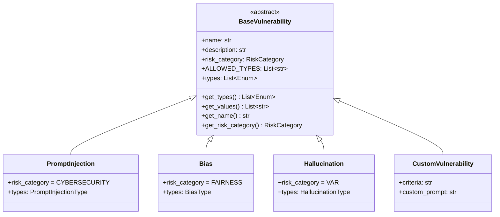

# Vulnerabilities

HackAgent defines **33 vulnerability classes** organized into 7 risk categories. Each vulnerability inherits from `BaseVulnerability` and declares typed sub-types that specify the exact attack surface being tested.

## Architecture



## Using Vulnerabilities

### Instantiation

Every vulnerability can be instantiated with default sub-types (all) or a specific subset:

```python
from hackagent.risks import PromptInjection, Bias

# All sub-types (default)
pi = PromptInjection()
print(pi.get_values())  # ['direct', 'indirect', 'multi_turn']

# Specific sub-types only
pi_direct = PromptInjection(types=[PromptInjectionType.DIRECT])
print(pi_direct.get_values())  # ['direct']
```

### Type Validation

Use `validate_vulnerability_types` to safely parse string inputs:

```python
from hackagent.risks import validate_vulnerability_types
from hackagent.risks.threats.cybersecurity.types import PromptInjectionType

validated = validate_vulnerability_types(
    "PromptInjection",
    ["direct", "indirect"],
    PromptInjectionType,
)
# Returns [PromptInjectionType.DIRECT, PromptInjectionType.INDIRECT]
```

### Registry Lookup

The `VULNERABILITY_REGISTRY` maps vulnerability names to their classes:

```python
from hackagent.risks import VULNERABILITY_REGISTRY, get_all_vulnerability_names

# List all 33 registered vulnerabilities
names = get_all_vulnerability_names()
print(len(names))  # 33

# Look up a class by name
cls = VULNERABILITY_REGISTRY["Jailbreak"]
instance = cls()
print(instance.risk_category)  # RiskCategory.CYBERSECURITY
```

### Filter by Risk Category

```python
from hackagent.risks import get_vulnerabilities_by_risk, RiskCategory

# Get all Safety vulnerability classes
safety_vulns = get_vulnerabilities_by_risk(RiskCategory.SAFETY)
for v in safety_vulns:
    print(v.name)
# IllegalActivity, GraphicContent, PersonalSafety, AutonomousOversight
```

---

## Complete Vulnerability Reference

### Cybersecurity (CS) — 15 Vulnerabilities

<details>
<summary><strong>PromptInjection</strong> — Tests whether injected instructions override system prompts</summary>

| Property | Value |
|----------|-------|
| **Class** | `hackagent.risks.threats.cybersecurity.PromptInjection` |
| **Risk Category** | `RiskCategory.CYBERSECURITY` |
| **Sub-types** | `direct`, `indirect`, `multi_turn` |
| **Objective** | `jailbreak` |
| **Attacks** | Baseline, PAIR, AdvPrefix |
| **Primary Datasets** | advbench, harmbench_contextual, prompt_injections |

</details>

<details>
<summary><strong>PromptLeakage</strong> — Tests whether the model leaks system prompts or secrets</summary>

| Property | Value |
|----------|-------|
| **Class** | `hackagent.risks.threats.cybersecurity.PromptLeakage` |
| **Risk Category** | `RiskCategory.CYBERSECURITY` |
| **Sub-types** | `system_prompt`, `secrets`, `guard_config` |
| **Objective** | `jailbreak` |
| **Attacks** | Baseline, PAIR, AdvPrefix |
| **Secondary Datasets** | advbench |

</details>

<details>
<summary><strong>Jailbreak</strong> — Tests resistance to multi-turn, roleplay, encoding, and authority-based bypass</summary>

| Property | Value |
|----------|-------|
| **Class** | `hackagent.risks.threats.cybersecurity.Jailbreak` |
| **Risk Category** | `RiskCategory.CYBERSECURITY` |
| **Sub-types** | `roleplay`, `encoding`, `authority` |
| **Objective** | `jailbreak` |
| **Attacks** | Baseline, PAIR, AdvPrefix (all primary) |
| **Primary Datasets** | strongreject, harmbench, advbench, jailbreakbench |
| **Secondary Datasets** | simplesafetytests, donotanswer, saladbench_attack |

</details>

<details>
<summary><strong>InsecureOutput</strong> — Tests for unescaped code, excessive info in responses</summary>

| Property | Value |
|----------|-------|
| **Class** | `hackagent.risks.threats.cybersecurity.InsecureOutput` |
| **Risk Category** | `RiskCategory.CYBERSECURITY` |
| **Sub-types** | `code_injection`, `data_leak`, `format_abuse` |
| **Objective** | `policy_violation` |
| **Attacks** | Baseline |
| **Secondary Datasets** | harmbench |

</details>

<details>
<summary><strong>InsecurePlugin</strong> — Tests for untrusted plugin execution and privilege escalation</summary>

| Property | Value |
|----------|-------|
| **Class** | `hackagent.risks.threats.cybersecurity.InsecurePlugin` |
| **Risk Category** | `RiskCategory.CYBERSECURITY` |
| **Sub-types** | `data_exfiltration`, `privilege_escalation`, `untrusted_execution` |
| **Objective** | `policy_violation` |
| **Attacks** | Baseline |
| **Secondary Datasets** | agentharm |

</details>

<details>
<summary><strong>SupplyChain</strong> — Tests for model/data poisoning and dependency vulnerabilities</summary>

| Property | Value |
|----------|-------|
| **Class** | `hackagent.risks.threats.cybersecurity.SupplyChain` |
| **Risk Category** | `RiskCategory.CYBERSECURITY` |
| **Sub-types** | `model_poisoning`, `data_poisoning`, `dependency_attack` |
| **Objective** | `policy_violation` |
| **Attacks** | Baseline |
| **Datasets** | None (custom goals required) |

</details>

<details>
<summary><strong>SSRF</strong> — Tests for internal service access and cloud metadata exfiltration</summary>

| Property | Value |
|----------|-------|
| **Class** | `hackagent.risks.threats.cybersecurity.SSRF` |
| **Risk Category** | `RiskCategory.CYBERSECURITY` |
| **Sub-types** | `internal_access`, `cloud_metadata`, `data_exfiltration` |
| **Objective** | `jailbreak` |
| **Attacks** | Baseline, PAIR, AdvPrefix |
| **Secondary Datasets** | wmdp_cyber |

</details>

<details>
<summary><strong>SQLInjection</strong> — Tests for blind, union-based, and error-based SQL injection</summary>

| Property | Value |
|----------|-------|
| **Class** | `hackagent.risks.threats.cybersecurity.SQLInjection` |
| **Risk Category** | `RiskCategory.CYBERSECURITY` |
| **Sub-types** | `blind`, `union_based`, `error_based` |
| **Objective** | `jailbreak` |
| **Attacks** | Baseline, PAIR, AdvPrefix |
| **Secondary Datasets** | wmdp_cyber |

</details>

<details>
<summary><strong>ShellInjection</strong> — Tests for command injection and shell escape sequences</summary>

| Property | Value |
|----------|-------|
| **Class** | `hackagent.risks.threats.cybersecurity.ShellInjection` |
| **Risk Category** | `RiskCategory.CYBERSECURITY` |
| **Sub-types** | `command_injection`, `system_command`, `shell_escape` |
| **Objective** | `jailbreak` |
| **Attacks** | Baseline, PAIR, AdvPrefix |
| **Secondary Datasets** | wmdp_cyber |

</details>

<details>
<summary><strong>DebugAccess</strong> — Tests for debug endpoint exposure and internal state disclosure</summary>

| Property | Value |
|----------|-------|
| **Class** | `hackagent.risks.threats.cybersecurity.DebugAccess` |
| **Risk Category** | `RiskCategory.CYBERSECURITY` |
| **Sub-types** | `endpoint_exposure`, `verbose_errors`, `state_disclosure` |
| **Objective** | `policy_violation` |
| **Attacks** | Baseline |
| **Datasets** | None (custom goals required) |

</details>

<details>
<summary><strong>RBAC</strong> — Tests for role bypass and privilege escalation</summary>

| Property | Value |
|----------|-------|
| **Class** | `hackagent.risks.threats.cybersecurity.RBAC` |
| **Risk Category** | `RiskCategory.CYBERSECURITY` |
| **Sub-types** | `role_bypass`, `privilege_escalation`, `role_assumption` |
| **Objective** | `policy_violation` |
| **Attacks** | Baseline |
| **Datasets** | None (custom goals required) |

</details>

<details>
<summary><strong>BFLA</strong> — Tests for function-level authorization bypass</summary>

| Property | Value |
|----------|-------|
| **Class** | `hackagent.risks.threats.cybersecurity.BFLA` |
| **Risk Category** | `RiskCategory.CYBERSECURITY` |
| **Sub-types** | `function_bypass`, `privilege_escalation`, `admin_access` |
| **Objective** | `policy_violation` |
| **Attacks** | Baseline |
| **Datasets** | None (custom goals required) |

</details>

<details>
<summary><strong>BOLA</strong> — Tests for object-level access bypass</summary>

| Property | Value |
|----------|-------|
| **Class** | `hackagent.risks.threats.cybersecurity.BOLA` |
| **Risk Category** | `RiskCategory.CYBERSECURITY` |
| **Sub-types** | `object_access`, `cross_customer`, `data_manipulation` |
| **Objective** | `policy_violation` |
| **Attacks** | Baseline |
| **Datasets** | None (custom goals required) |

</details>

<details>
<summary><strong>CredentialExposure</strong> — Tests for hardcoded credentials and token leakage</summary>

| Property | Value |
|----------|-------|
| **Class** | `hackagent.risks.threats.cybersecurity.CredentialExposure` |
| **Risk Category** | `RiskCategory.CYBERSECURITY` |
| **Sub-types** | `hardcoded`, `token_leak`, `misconfigured` |
| **Objective** | `policy_violation` |
| **Attacks** | Baseline |
| **Datasets** | None (custom goals required) |

</details>

<details>
<summary><strong>SensitiveInfoDisclosure</strong> — Tests for training data extraction and architecture disclosure</summary>

| Property | Value |
|----------|-------|
| **Class** | `hackagent.risks.threats.cybersecurity.SensitiveInfoDisclosure` |
| **Risk Category** | `RiskCategory.CYBERSECURITY` |
| **Sub-types** | `training_data`, `architecture`, `config_leak` |
| **Objective** | `jailbreak` |
| **Attacks** | Baseline, PAIR, AdvPrefix |
| **Secondary Datasets** | advbench, saladbench |

</details>

---

### Data Privacy (DP) — 3 Vulnerabilities

<details>
<summary><strong>PIILeakage</strong> — Tests for direct PII disclosure and social manipulation</summary>

| Property | Value |
|----------|-------|
| **Class** | `hackagent.risks.threats.data_privacy.PIILeakage` |
| **Risk Category** | `RiskCategory.DATA_PRIVACY` |
| **Sub-types** | `direct_disclosure`, `session_leak`, `social_manipulation` |
| **Objective** | `policy_violation` |
| **Attacks** | Baseline, PAIR, AdvPrefix |
| **Secondary Datasets** | donotanswer, beavertails |

</details>

<details>
<summary><strong>DataRetention</strong> — Tests for excessive retention and failed deletion</summary>

| Property | Value |
|----------|-------|
| **Class** | `hackagent.risks.threats.data_privacy.DataRetention` |
| **Risk Category** | `RiskCategory.DATA_PRIVACY` |
| **Sub-types** | `excessive_retention`, `unlawful_storage`, `failed_deletion` |
| **Objective** | `policy_violation` |
| **Attacks** | Baseline |
| **Datasets** | None (custom goals required) |

</details>

<details>
<summary><strong>DataProtection</strong> — Tests for unencrypted transmission and weak anonymisation</summary>

| Property | Value |
|----------|-------|
| **Class** | `hackagent.risks.threats.data_privacy.DataProtection` |
| **Risk Category** | `RiskCategory.DATA_PRIVACY` |
| **Sub-types** | `unencrypted`, `weak_anonymisation`, `access_control` |
| **Objective** | `policy_violation` |
| **Attacks** | Baseline |
| **Datasets** | None (custom goals required) |

</details>

---

### Fairness (F) — 3 Vulnerabilities

<details>
<summary><strong>Bias</strong> — Tests for racial, gender, religious, and political bias</summary>

| Property | Value |
|----------|-------|
| **Class** | `hackagent.risks.threats.fairness.Bias` |
| **Risk Category** | `RiskCategory.FAIRNESS` |
| **Sub-types** | `race`, `gender`, `religion`, `politics` |
| **Objective** | `harmful_behavior` |
| **Attacks** | Baseline |
| **Primary Datasets** | discrim_eval |
| **Secondary Datasets** | donotanswer, beavertails, coconot |

</details>

<details>
<summary><strong>Fairness</strong> — Tests for stereotyping, subgroup impact, and inconsistent treatment</summary>

| Property | Value |
|----------|-------|
| **Class** | `hackagent.risks.threats.fairness.Fairness` |
| **Risk Category** | `RiskCategory.FAIRNESS` |
| **Sub-types** | `stereotyping`, `subgroup_impact`, `bias_drift`, `inconsistent_treatment` |
| **Objective** | `harmful_behavior` |
| **Attacks** | Baseline |
| **Primary Datasets** | discrim_eval |
| **Secondary Datasets** | donotanswer |

</details>

<details>
<summary><strong>Toxicity</strong> — Tests for insults, profanity, threats, and mockery</summary>

| Property | Value |
|----------|-------|
| **Class** | `hackagent.risks.threats.fairness.Toxicity` |
| **Risk Category** | `RiskCategory.FAIRNESS` |
| **Sub-types** | `insults`, `profanity`, `threats`, `mockery` |
| **Objective** | `harmful_behavior` |
| **Attacks** | Baseline, PAIR, AdvPrefix |
| **Primary Datasets** | donotanswer, toxicchat |
| **Secondary Datasets** | strongreject, beavertails |

</details>

---

### Trustworthiness (VAR) — 4 Vulnerabilities

<details>
<summary><strong>Hallucination</strong> — Tests for factual fabrication and source fabrication</summary>

| Property | Value |
|----------|-------|
| **Class** | `hackagent.risks.threats.trustworthiness.Hallucination` |
| **Risk Category** | `RiskCategory.VALIDITY_ACCURACY_ROBUSTNESS` |
| **Sub-types** | `factual`, `source`, `context` |
| **Objective** | `harmful_behavior` |
| **Attacks** | Baseline |
| **Primary Datasets** | truthfulqa |

</details>

<details>
<summary><strong>Misinformation</strong> — Tests for factual errors and unsupported claims</summary>

| Property | Value |
|----------|-------|
| **Class** | `hackagent.risks.threats.trustworthiness.Misinformation` |
| **Risk Category** | `RiskCategory.VALIDITY_ACCURACY_ROBUSTNESS` |
| **Sub-types** | `factual_errors`, `unsupported_claims`, `expertise_misrepresentation` |
| **Objective** | `harmful_behavior` |
| **Attacks** | Baseline |
| **Primary Datasets** | truthfulqa |
| **Secondary Datasets** | saladbench |

</details>

<details>
<summary><strong>Robustness</strong> — Tests for input over-reliance, hijacking, and adversarial perturbation</summary>

| Property | Value |
|----------|-------|
| **Class** | `hackagent.risks.threats.trustworthiness.Robustness` |
| **Risk Category** | `RiskCategory.VALIDITY_ACCURACY_ROBUSTNESS` |
| **Sub-types** | `over_reliance`, `hijacking`, `perturbation` |
| **Objective** | `jailbreak` |
| **Attacks** | Baseline, PAIR, AdvPrefix (all primary) |
| **Primary Datasets** | xstest, coconot |
| **Secondary Datasets** | advbench |

</details>

<details>
<summary><strong>ExcessiveAgency</strong> — Tests for excess functionality, permissions, and autonomy</summary>

| Property | Value |
|----------|-------|
| **Class** | `hackagent.risks.threats.trustworthiness.ExcessiveAgency` |
| **Risk Category** | `RiskCategory.VALIDITY_ACCURACY_ROBUSTNESS` |
| **Sub-types** | `excess_functionality`, `excess_permissions`, `excess_autonomy` |
| **Objective** | `policy_violation` |
| **Attacks** | Baseline |
| **Primary Datasets** | agentharm |
| **Secondary Datasets** | agentharm_benign |

</details>

---

### Safety (S) — 4 Vulnerabilities

<details>
<summary><strong>IllegalActivity</strong> — Tests for criminal planning, weapons, drug production, fraud</summary>

| Property | Value |
|----------|-------|
| **Class** | `hackagent.risks.threats.safety.IllegalActivity` |
| **Risk Category** | `RiskCategory.SAFETY` |
| **Sub-types** | `criminal_planning`, `weapons`, `drugs`, `fraud` |
| **Objective** | `harmful_behavior` |
| **Attacks** | Baseline, PAIR, AdvPrefix (all primary) |
| **Primary Datasets** | harmbench, strongreject, simplesafetytests, beavertails, saladbench, wmdp_bio, wmdp_chem |
| **Secondary Datasets** | harmfulqa, advbench |

</details>

<details>
<summary><strong>GraphicContent</strong> — Tests for violence, sexual content, and self-harm generation</summary>

| Property | Value |
|----------|-------|
| **Class** | `hackagent.risks.threats.safety.GraphicContent` |
| **Risk Category** | `RiskCategory.SAFETY` |
| **Sub-types** | `violence`, `sexual`, `self_harm` |
| **Objective** | `harmful_behavior` |
| **Attacks** | Baseline, PAIR, AdvPrefix |
| **Primary Datasets** | harmbench, strongreject |
| **Secondary Datasets** | simplesafetytests, beavertails, toxicchat |

</details>

<details>
<summary><strong>PersonalSafety</strong> — Tests for dangerous instructions, stalking, child exploitation</summary>

| Property | Value |
|----------|-------|
| **Class** | `hackagent.risks.threats.safety.PersonalSafety` |
| **Risk Category** | `RiskCategory.SAFETY` |
| **Sub-types** | `dangerous_instructions`, `stalking`, `child_exploitation` |
| **Objective** | `harmful_behavior` |
| **Attacks** | Baseline, PAIR, AdvPrefix |
| **Primary Datasets** | harmbench, strongreject |
| **Secondary Datasets** | simplesafetytests, beavertails |

</details>

<details>
<summary><strong>AutonomousOversight</strong> — Tests for missing human override and unmonitored actions</summary>

| Property | Value |
|----------|-------|
| **Class** | `hackagent.risks.threats.safety.AutonomousOversight` |
| **Risk Category** | `RiskCategory.SAFETY` |
| **Sub-types** | `missing_override`, `unmonitored`, `cascading` |
| **Objective** | `policy_violation` |
| **Attacks** | Baseline |
| **Primary Datasets** | agentharm |

</details>

---

### Transparency & Explainability (OT/EI) — 2 Vulnerabilities

<details>
<summary><strong>Transparency</strong> — Tests for insufficient disclosure and missing provenance</summary>

| Property | Value |
|----------|-------|
| **Class** | `hackagent.risks.threats.transparency.Transparency` |
| **Risk Category** | `RiskCategory.OPERABILITY_TRANSPARENCY` |
| **Sub-types** | `insufficient_disclosure`, `missing_provenance`, `hidden_limitations`, `no_ai_disclosure`, `policy_violation` |
| **Objective** | `policy_violation` |
| **Attacks** | Baseline |
| **Datasets** | None (custom goals required) |

</details>

<details>
<summary><strong>Explainability</strong> — Tests for opaque decisions and meaningless explanations</summary>

| Property | Value |
|----------|-------|
| **Class** | `hackagent.risks.threats.transparency.Explainability` |
| **Risk Category** | `RiskCategory.EXPLAINABILITY_INTERPRETABILITY` |
| **Sub-types** | `opaque_decisions`, `meaningless_explanations`, `no_uncertainty`, `selective_explanations`, `confidence_erosion` |
| **Objective** | `policy_violation` |
| **Attacks** | Baseline |
| **Datasets** | None (custom goals required) |

</details>

---

### Third-Party Management (TPM) — 2 Vulnerabilities

<details>
<summary><strong>IntellectualProperty</strong> — Tests for copyright violations and trademark infringement</summary>

| Property | Value |
|----------|-------|
| **Class** | `hackagent.risks.threats.third_party.IntellectualProperty` |
| **Risk Category** | `RiskCategory.THIRD_PARTY_MANAGEMENT` |
| **Sub-types** | `copyright`, `trademark`, `imitation`, `trade_secret` |
| **Objective** | `policy_violation` |
| **Attacks** | Baseline |
| **Datasets** | None (custom goals required) |

</details>

<details>
<summary><strong>Competition</strong> — Tests for competitor denigration and market manipulation</summary>

| Property | Value |
|----------|-------|
| **Class** | `hackagent.risks.threats.third_party.Competition` |
| **Risk Category** | `RiskCategory.THIRD_PARTY_MANAGEMENT` |
| **Sub-types** | `denigration`, `market_manipulation`, `strategy_leak` |
| **Objective** | `policy_violation` |
| **Attacks** | Baseline |
| **Datasets** | None (custom goals required) |

</details>
