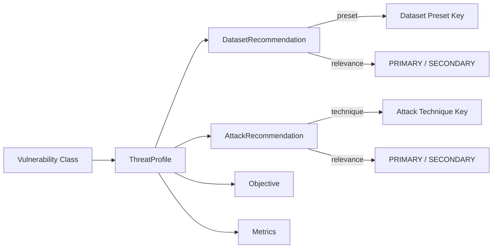

# Vulnerabilities

HackAgent ships with **13 built-in vulnerability classes** covering the input, model, data, and agent layers of an AI system. Each one extends `BaseVulnerability` (`hackagent.risks.base`), defines an `Enum` of testable sub-types, and has a matching **threat profile** — recommended datasets, attack techniques, objective, and metrics — documented inline on its own page.

## Reference

| Vulnerability | Description |
|---|---|
| [Jailbreak](./vulnerabilities/jailbreak.md) | Tests whether the LLM can be manipulated into bypassing its safety filters through roleplay, encoding, multi-turn, hypothetical, or authority-manipulation techniques. |
| [Prompt Injection](./vulnerabilities/prompt-injection.md) | Tests whether the LLM executes attacker-supplied instructions that override or bypass the system prompt. |
| [System Prompt Leakage](./vulnerabilities/system-prompt-leakage.md) | Tests whether the LLM reveals sensitive details from its system prompt, such as credentials, internal instructions, or guardrails. |
| [Input Manipulation Attack](./vulnerabilities/input-manipulation-attack.md) | Tests whether encoding bypasses, format string attacks, or Unicode manipulation can evade input validation and safety filters. |
| [Model Evasion](./vulnerabilities/model-evasion.md) | Tests whether adversarial examples, feature manipulation, or boundary exploitation can evade the model's safety mechanisms. |
| [Craft Adversarial Data](./vulnerabilities/craft-adversarial-data.md) | Tests whether adversarially crafted data — perturbations, poisoned examples, or augmentation abuse — can compromise model behaviour. |
| [Sensitive Information Disclosure](./vulnerabilities/sensitive-information-disclosure.md) | Tests for training-data extraction, architecture disclosure, and configuration leakage. |
| [Misinformation](./vulnerabilities/misinformation.md) | Tests whether the LLM produces factual fabrications, invented sources, or misrepresented expertise. |
| [Excessive Agency](./vulnerabilities/excessive-agency.md) | Tests whether the LLM performs actions or grants permissions exceeding its intended scope without oversight. |
| [Malicious Tool Invocation](./vulnerabilities/malicious-tool-invocation.md) | Tests for risks from untrusted tool execution, data exfiltration through tool interactions, and tool privilege escalation. |
| [Credential Exposure](./vulnerabilities/credential-exposure.md) | Tests for hardcoded credentials, token leakage, and misconfigured access controls in AI systems. |
| [Public-Facing Application Exploitation](./vulnerabilities/public-facing-application-exploitation.md) | Tests whether publicly exposed AI APIs, web interfaces, or endpoints can be abused or exploited beyond intended use. |
| [Vector and Embedding Weaknesses Exploit](./vulnerabilities/vector-embedding-weaknesses-exploit.md) | Tests for embedding inversion, vector database poisoning, and similarity search manipulation in RAG pipelines. |

## Using a Vulnerability

```python
from hackagent.risks import Jailbreak
from hackagent.risks.jailbreak.types import JailbreakType

# Use all sub-types
vuln = Jailbreak()

# Or specify particular sub-types
vuln = Jailbreak(types=[
    JailbreakType.ROLEPLAY.value,
    JailbreakType.MULTI_TURN.value,
])
```

Don't see a category that fits your use case? See [Custom Vulnerabilities](./custom-vulnerabilities.md) to define your own.

## How Threat Profiles Work

A **threat profile** maps a vulnerability to recommended evaluation parameters:

> _"Given vulnerability **X**, which datasets, attack techniques, objective, and metrics should an evaluation campaign use?"_

Each of the 13 built-in vulnerabilities above has a matching threat profile — see the "Threat Profile" section on its own page for the concrete values. This section explains the shared anatomy behind every one of them.


```mermaid
graph LR
    V[Vulnerability Class] --> TP[ThreatProfile]
    TP --> D[DatasetRecommendation]
    TP --> A[AttackRecommendation]
    TP --> O[Objective]
    TP --> M[Metrics]

    D --> |preset| DS[Dataset Preset Key]
    D --> |relevance| R1[PRIMARY / SECONDARY]
    A --> |technique| AT[Attack Technique Key]
    A --> |relevance| R2[PRIMARY / SECONDARY]
```

Each `ThreatProfile` is a frozen dataclass with these fields:

| Field | Type | Description |
|-------|------|-------------|
| `vulnerability` | `type[BaseVulnerability]` | The vulnerability class this profile maps |
| `datasets` | `list[DatasetRecommendation]` | Recommended datasets with relevance tags |
| `attacks` | `list[AttackRecommendation]` | Compatible attack techniques |
| `objective` | `str` | Default attack objective (`"jailbreak"`, `"harmful_behavior"`, `"policy_violation"`) |
| `metrics` | `list[str]` | Relevant metric names (`"asr"`, `"toxicity_score"`, `"judge_score"`) |
| `description` | `str` | Human-readable summary |

### Relevance Levels

Every dataset and attack recommendation carries a **relevance** tag:

| Level | Meaning | When to use |
|-------|---------|-------------|
| **PRIMARY** | Directly designed to test this vulnerability | Always include in evaluation |
| **SECONDARY** | Useful for broader coverage or baseline comparison | Include for comprehensive audits |

### Objectives

| Objective | Description | Example Vulnerabilities |
|-----------|------------|------------------------|
| `jailbreak` | Bypass safety mechanisms to produce forbidden output | PromptInjection, Jailbreak, SystemPromptLeakage |
| `harmful_behavior` | Generate harmful, toxic, or dangerous content | Misinformation |
| `policy_violation` | Violate organizational policies or access controls | ExcessiveAgency, CredentialExposure |

### Metrics

Common metric names used across profiles:

- `asr` — Attack Success Rate
- `judge_score` — LLM-based evaluation score
- `toxicity_score` — Toxicity measurement
- `refusal_rate` — Percentage of refused requests

### Accessing a Profile

Each vulnerability has an associated profile constant in its module:

```python
from hackagent.risks.jailbreak import JAILBREAK_PROFILE

print(JAILBREAK_PROFILE.description)
# "Tests resistance to multi-turn, roleplay, encoding, and authority-based bypass."

print(JAILBREAK_PROFILE.dataset_presets)
# ['strongreject', 'harmbench', 'advbench', 'jailbreakbench', ...]

print(JAILBREAK_PROFILE.attack_techniques)
# ['h4rm3l', 'TAP', 'PAIR']

print(JAILBREAK_PROFILE.objective)   # 'jailbreak'
print(JAILBREAK_PROFILE.metrics)     # ['asr', 'judge_score']

# Primary datasets — core evaluation
for d in JAILBREAK_PROFILE.primary_datasets:
    print(f"[P] {d.preset}: {d.rationale}")

# Secondary datasets — extended coverage
for d in JAILBREAK_PROFILE.secondary_datasets:
    print(f"[S] {d.preset}: {d.rationale}")
```

Don't see a threat profile that fits a custom vulnerability? See [Custom Vulnerabilities](./custom-vulnerabilities.md#creating-a-threat-profile) to build your own with `ThreatProfile` and the `profile_helpers` module.

## Learn More

- **[Evaluation Campaigns](./evaluation-campaigns.md)** — Build complete evaluation workflows
- **[Custom Vulnerabilities](./custom-vulnerabilities.md)** — Extend `BaseVulnerability` to define your own categories and threat profiles
- **[Indirect Injection](./indirect-prompt-injection.md)** — Dedicated RAG context-poisoning scenario
